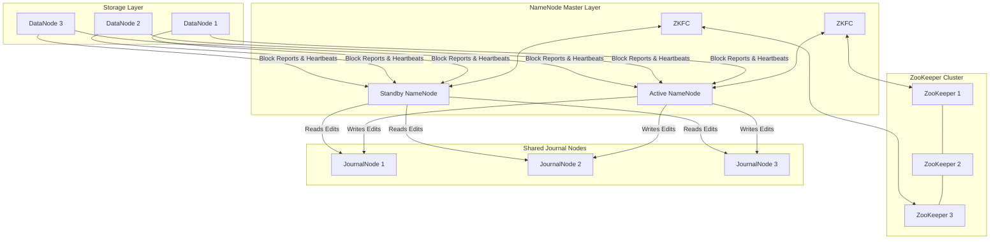

# 📦 Module 02: HDFS Storage Mastery

HDFS (Hadoop Distributed File System) is a distributed, user-space, user-level file system designed to store petabytes of data reliably across commodity hardware. It is designed to handle very large files (gigabytes to terabytes) using a streaming data access pattern ("Write Once, Read Many").

---

## 1. HDFS Daemon Architecture & High Availability (HA)

A production-grade HDFS cluster relies on an Active-Standby NameNode architecture coordinated by ZooKeeper and the Quorum Journal Manager (QJM) to eliminate the single point of failure (SPOF).



### Components Detailed:
* **Active NameNode**: Manages the namespace (directory tree, file-to-block mapping) and handles all client metadata operations (opens, renames, directory modifications).
* **Standby NameNode**: Synchronizes its state with the Active NameNode by constantly reading transactions from the JournalNodes and applying them to its namespace representation. It acts as a warm standby.
* **Secondary NameNode (Checkpointing Service)**: 
  * > [!IMPORTANT]
    > **Misconception**: The Secondary NameNode is NOT a backup/failover server. It is a checkpoint daemon that merges the NameNode's memory image (`fsimage`) with the change log (`edits`) to keep edit logs from growing too large. 
    > **Note**: In a High Availability (HA) cluster, the Standby NameNode performs this checkpointing work, so the Secondary NameNode is not run.
* **DataNodes**: Store and retrieve block data as raw files on the local filesystem of the worker nodes. They send periodic **Block Reports** (every 6 hours) and **Heartbeats** (every 3 seconds) to the NameNode.
* **JournalNodes (QJM)**: A quorum-based cluster (must have at least 3 nodes, surviving \(N/2 + 1\) failures) where the Active NameNode writes transactions (Edits) and the Standby reads them to stay up-to-date.
* **ZooKeeper Failover Controller (ZKFC)**: A daemon running on both NameNode hosts. It monitors the NameNode's health, maintains a session lock inside ZooKeeper (`/hadoop-ha/...`), and coordinates automatic failover to the Standby if the Active fails.
* **ZooKeeper Cluster**: Provides distributed consensus. If ZKFC loses its session with ZooKeeper, the lock is released, and the other ZKFC transitions the Standby NameNode to Active.

---

## 2. HDFS Data Flow: Read & Write Pipelines

Understanding read/write pathways at the packet level is crucial for performance troubleshooting.

### The Write Path (Creating a File):
1. **Client Request**: The client calls `FileSystem.create(filePath)` on the DistributedFileSystem object.
2. **Metadata Verification**: The DistributedFileSystem makes an RPC call to the NameNode. The NameNode checks if the file exists, if the client has permissions, and creates a record in the namespace. It returns a list of target DataNodes for the first block.
3. **Pipeline Construction**: The client initiates a pipeline by connecting to the first DataNode. DataNode 1 connects to DataNode 2, and DataNode 2 connects to DataNode 3.
4. **Data Streaming**: The client splits the block data into small **Packets** (64KB) and queues them into a **Data Queue**. The packet is sent to DataNode 1, which writes it locally and forwards it down the pipeline.
5. **Acknowledgment Loop**: Packets are moved to an **Ack Queue on the client. DataNodes pass acknowledgements back up the pipeline (DN3 -> DN2 -> DN1 -> Client). Once the client receives ACKs from all nodes, it removes the packet from the Ack Queue.
6. **Finalization**: When the file is complete, the client calls `close()`, which flushes remaining packets and notifies the NameNode that the file write is complete.

### The Read Path:
1. **Metadata Query**: The client calls `FileSystem.open(filePath)`. DistributedFileSystem sends an RPC to the NameNode to get the block locations for the file. The NameNode returns DataNode addresses hosting replicas, sorted by network proximity to the client.
2. **Direct Connection**: The client connects to the closest DataNode via `FSDataInputStream` and reads block data.
3. **Verification**: The client verifies checksums on the packets. If a block is corrupt, the client reports it to the NameNode and reads from the next replica.
4. **Sequential Read**: When block data is read, the stream closes and opens connections to the next block locations.

---

## 3. Block Placement Policy & Network Topology

To optimize reliability and write network bandwidth, HDFS defaults to a **Rack-Aware Placement Policy**:

```text
Block Replica 1 ─────────> Client Host (if local DataNode exists, else random)
Block Replica 2 ─────────> Remote Rack, random node
Block Replica 3 ─────────> Remote Rack, different node on that same remote rack
```

* **Rationale**: Putting two replicas on the same rack minimizes inter-rack network traffic on writes, while putting the second replica on a different rack ensures survival if an entire rack switch fails.

---

## 4. NameNode Federation & Fencing

### NameNode Federation:
To scale beyond a single NameNode cluster (which hits memory scaling limits at ~500 million files), HDFS Federation allows running multiple independent NameNodes.
* They share the same pool of DataNodes.
* Each NameNode manages its own **Namespace Volume** and its own **Block Pool** (a collection of blocks belonging to a namespace).
* The namespaces are mount-mapped at the client level using ViewHDFS (`viewfs://`).

### Fencing (Split-Brain Prevention):
During a failover, if the Active NameNode hangs (e.g., due to a long GC pause), ZooKeeper may think it is dead and try to make the Standby active. To prevent both nodes from acting as Active simultaneously (corrupting HDFS edits), the Standby must **fence** the previous Active node:
* **SSH Fence (`sshfence`)**: ZKFC SSHs into the old Active host and runs `kill -9` on the NameNode process.
* **Shell Fence (`shell`)**: ZKFC runs a custom script (e.g., cut off network switch port or power off host using IPMI interface).

---

## 5. Storage Policies & Tiering (Heterogeneous Storage)

HDFS allows tiering files to different storage types: **DISK** (standard HDD), **ARCHIVE** (high-density, slow HDDs), **SSD** (Solid State Drive), and **RAM_DISK** (in-memory temporary storage).

### Storage Policies:
* **Hot (default)**: All replicas on DISK.
* **Cold**: All replicas on ARCHIVE.
* **Warm**: One replica on DISK, remaining replicas on ARCHIVE.
* **All_SSD**: All replicas on SSD.
* **One_SSD**: One replica on SSD, remaining replicas on DISK.
* **Lazy_Persist**: First replica written quickly to RAM_DISK, then asynchronously flushed to DISK.

### CLI Storage Policy Commands:
```bash
# List all available storage policies in the cluster
hdfs storagepolicies -listPolicies

# Set storage policy of a directory to COLD
hdfs storagepolicies -setStoragePolicy -path /user/hive/warehouse/old_sales -policy COLD

# Get the current storage policy of a directory
hdfs storagepolicies -getStoragePolicy -path /user/hive/warehouse/old_sales

# Force HDFS to apply storage policies (moves physical blocks to correct media)
hdfs mover -path /user/hive/warehouse/old_sales
```

---

## 6. Complete HDFS CLI Reference Library

This library contains the exhaustive list of HDFS file system and administrative commands.

### A. File and Directory Operations (`hdfs dfs`)
* **`ls`**: Lists directory contents.
  * `hdfs dfs -ls /data`: List directory contents.
  * `hdfs dfs -ls -R /data`: Recursively list all directories and files.
* **`mkdir`**: Create directories.
  * `hdfs dfs -mkdir -p /user/spark/logs`: Create nested directories.
* **`put` / `copyFromLocal`**: Copy files from local OS disk to HDFS.
  * `hdfs dfs -put -f local_file.txt /data/`: Upload file, forcing overwrite (`-f`).
  * `hdfs dfs -put -q 1048576 local_file.txt /data/`: Upload with custom write buffer chunk size (1MB).
* **`get` / `copyToLocal`**: Download files from HDFS to local OS disk.
  * `hdfs dfs -get /data/file.txt ./local_dir/`: Download file.
* **`cp` / `mv`**: Copy or move files within HDFS.
  * `hdfs dfs -cp /raw/data.csv /backup/data.csv`
  * `hdfs dfs -mv /tmp/data.csv /user/hive/warehouse/`
* **`rm`**: Delete files.
  * `hdfs dfs -rm /data/sales.csv`: Move file to HDFS Trash bin.
  * `hdfs dfs -rm -r -skipTrash /data/temp_dir`: Force delete directory recursively, bypassing trash.
* **`cat` / `tail` / `text`**: Read file contents.
  * `hdfs dfs -cat /data/logs.txt`
  * `hdfs dfs -tail /data/app.log`
  * `hdfs dfs -text /data/logs.txt.gz`: Decompress and print text files (supports gzip, bzip2, zip formats).
* **`du`**: Show space consumed.
  * `hdfs dfs -du -h -s /user/hive/warehouse/`: Show human-readable summarized size of a warehouse path.
* **`setrep`**: Change replication factor of a path.
  * `hdfs dfs -setrep -w 2 -R /data/logs`: Set replication factor to 2 recursively, and wait (`-w`) until the replication matches the target across all blocks.
* **`checksum`**: Print MD5-of-MD5 CRC32 checksum.
  * `hdfs dfs -checksum /data/file.csv`: Compare file integrity across nodes.

### B. HDFS Snapshot Operations
* **`allowSnapshot`**: Allow snapshots on a path (needs admin role).
  * `hdfs dfsadmin -allowSnapshot /data/project`
* **`createSnapshot`**: Create metadata backup.
  * `hdfs dfs -createSnapshot /data/project snap_v1`
* **`deleteSnapshot`**: Delete backup.
  * `hdfs dfs -deleteSnapshot /data/project snap_v1`
* **`renameSnapshot`**: Rename backup.
  * `hdfs dfs -renameSnapshot /data/project snap_v1 snap_v1_final`

### C. HDFS Administrative & Checking Commands (`hdfs dfsadmin` / `hdfs fsck`)
* **`report`**: Check overall health.
  * `hdfs dfsadmin -report`: Shows capacity, cluster status, dead nodes, and corrupt blocks.
* **`safemode`**: Manage read-only maintenance mode.
  * `hdfs dfsadmin -safemode get`: Get state.
  * `hdfs dfsadmin -safemode enter`: Force enter safemode.
  * `hdfs dfsadmin -safemode leave`: Force leave safemode.
  * `hdfs dfsadmin -safemode wait`: Block script execution until NameNode leaves safemode.
* **`fsck`**: File system check.
  * `hdfs fsck /`: Run file system scan.
  * `hdfs fsck /data/sales.csv -files -blocks -locations -racks`: Print file details showing blocks, their rack topology locations, and node hosts.
  * `hdfs fsck / -delete`: Scan HDFS and delete corrupted files immediately.
  * `hdfs fsck / -move`: Scan HDFS and move corrupted blocks to `/lost+found`.
* **`balancer`**: Cluster block distribution balancer.
  * `hdfs balancer -threshold 10`: Balance block occupancy across DataNodes until the differences in disk usage per node are within 10%.
* **`refreshNodes`**: Re-read worker hosts.
  * `hdfs dfsadmin -refreshNodes`: Updates the NameNode on added or decommissioned DataNodes listed in the include/exclude configuration files.
* **`metasave`**: Dump memory status.
  * `hdfs dfsadmin -metasave metasave_dump.txt`: Save NameNode metadata status (replication queues, under-replicated block lists, heartbeats) to a local file.

---

## 7. Performance Tuning & Configurations

Edit configurations in `hdfs-site.xml`:

* **`dfs.blocksize`**: 
  * Default: `134217728` (128MB). 
  * Tuning: Increase to 256MB or 512MB for multi-terabyte data warehouses to reduce the metadata footprint in the NameNode memory.
* **NameNode Heap Formula**:
  * > [!TIP]
    > As a rule of thumb, each namespace object (file, directory, block) takes roughly **150 bytes** in the NameNode JVM heap.
    > If a cluster contains 100,000,000 files, and each file has an average of 1.5 blocks (150,000,000 blocks), total objects = 250,000,000.
    > Heap memory required: \(250,000,000 \times 150 \text{ bytes} \approx 37.5 \text{ GB}\) heap just for metadata storage.
* **`dfs.namenode.handler.count`**: 
  * Thread count for handling RPC calls. Default is `10`. Increase to `100` or more on large clusters (e.g., \(20 \times \log(\text{DataNodes})\)) to prevent RPC timeouts.

---

## 8. Enterprise Job Interview Q&A (HDFS Storage)

This section prepares you for production-level interview questions.

### Q1: What happens under the hood when an Active NameNode crashes? Explain how the Standby takes over and how split-brain is prevented.
* **How to explain this to the interviewer**:
  Do not just say "ZooKeeper handles it." Break down the roles of the ZKFC, the ZooKeeper lock path, the JournalNode sync checks, and the active fencing methods.

* **Model Answer**:
  "When the Active NameNode crashes, the ZooKeeper Failover Controller (ZKFC) running on the active host detects the failure (either through heartbeats or because the NameNode process died). ZKFC immediately terminates its active session with the ZooKeeper cluster, which automatically deletes the ephemeral lock znode `/hadoop-ha/.../ActiveStandbyElectorLock`.
  
  The ZKFC on the Standby NameNode node is listening to changes on that znode. Once deleted, it attempts to acquire the lock. 
  
  Before transitioning the Standby NameNode to Active, ZKFC must perform **fencing** to ensure the old NameNode is dead and cannot write edits (Split-Brain scenario). ZKFC runs the configured fencing method:
  1. It attempts to SSH into the old Active host and kill the NameNode process (`sshfence`).
  2. If that fails, it runs a shell script (`shell` fence) to invoke a remote power switch (IPMI) or block the port on the switch.
  
  Once fenced, the Standby NameNode verifies that it has read all outstanding transaction edit logs from the JournalNodes. It then transitions its status to Active and begins accepting client connections."

---

### Q2: How do you identify, analyze, and resolve under-replicated or corrupted blocks in an HDFS cluster?
* **How to explain this to the interviewer**:
  Define what under-replicated and corrupted blocks are (under-replicated = count is less than target, corrupted = all replicas are lost or have checksum mismatches). State the commands you run to identify them and the resolution steps.

* **Model Answer**:
  "To identify the blocks, I run `hdfs fsck /` (File System Check). The output reports the percentage of healthy blocks, the list of under-replicated blocks, and corrupted blocks.
  
  * **Under-Replicated Blocks**: This occurs if a DataNode goes offline. The NameNode notices the missing block replicas via block reports. It places them in the replication queue, and other DataNodes automatically replicate them to match the target replication factor. If I need to speed up the process, I can run `hdfs dfs -setrep -R <target> /path` to trigger replication, or wait for the HDFS Balancer if disk imbalance is preventing replication.
  
  * **Corrupt Blocks (Missing Replicas)**: This is critical; it means all copies of the block are unreadable or lost. I run `hdfs fsck / -list-corruptfileblocks` to identify the specific files affected. 
  
  If the raw files can be recovered or re-ingested from a source (like Kafka or a database), I delete the corrupted files using `hdfs dfs -rm -skipTrash /path/file` to clean up HDFS, and re-run the ingestion pipeline. If the file is unrecoverable, I either restore from an HDFS snapshot (`.snapshot`) or extract the partial block segments from `/lost+found` using the `hdfs fsck / -move` command."

---

### Q3: What is HDFS Storage Tiering, and how would you configure a policy to automatically move cold data to archiving disks?
* **How to explain this to the interviewer**:
  Explain the concepts of heterogeneous storage, the available media types (SSD, DISK, ARCHIVE), the commands to apply policies, and how HDFS actually executes the movement of the block files.

* **Model Answer**:
  "HDFS Storage Tiering allows classifying files under specific storage media types based on data access frequency. We configure our DataNodes with mount tags in `hdfs-site.xml` under `dfs.datanode.data.dir` like `[SSD]/mnt/ssd/data,[ARCHIVE]/mnt/hdd/data`.
  
  To automate moving cold data to ARCHIVE:
  1. I define an HDFS storage policy on the target directory (e.g. `/user/hive/warehouse/historical_logs`) using the command:
     `hdfs storagepolicies -setStoragePolicy -path /user/hive/warehouse/historical_logs -policy COLD`
  
  2. Setting the policy only affects metadata. The physical blocks still reside on the hot DISK media. To force HDFS to move the blocks to ARCHIVE disks, I schedule a cron job that executes the **HDFS Mover tool**:
     `hdfs mover -path /user/hive/warehouse/historical_logs`
     
  The Mover scans the blocks, identifies block placements violating the `COLD` policy, and initiates network-efficient migrations inside the DataNodes."
