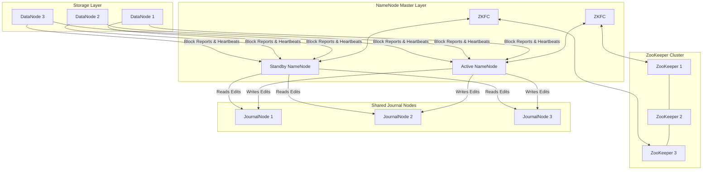

# 📦 Module 02: HDFS Storage Mastery

HDFS (Hadoop Distributed File System) is a distributed, user-space, user-level file system designed to store petabytes of data reliably across commodity hardware. It is designed to handle very large files (gigabytes to terabytes) using a streaming data access pattern ("Write Once, Read Many").

---

## 1. HDFS Daemon Architecture & High Availability (HA)

A production-grade HDFS cluster relies on an Active-Standby NameNode architecture coordinated by ZooKeeper and the Quorum Journal Manager (QJM) to eliminate the single point of failure (SPOF).



### Components Detailed:
* **Active NameNode**: Manages the namespace (directory tree, file-to-block mapping) and handles all client metadata operations (opens, renames, directory modifications).
* **Standby NameNode**: Synchronizes its state with the Active NameNode by constantly reading transactions from the JournalNodes and applying them to its namespace representation. It acts as a warm standby.
* **Secondary NameNode (Checkpointing Service)**: 
  * > [!IMPORTANT]
    > **Misconception**: The Secondary NameNode is NOT a backup/failover server. It is a checkpoint daemon that merges the NameNode's memory image (`fsimage`) with the change log (`edits`) to keep edit logs from growing too large. 
    > **Note**: In a High Availability (HA) cluster, the Standby NameNode performs this checkpointing work, so the Secondary NameNode is not run.
* **DataNodes**: Store and retrieve block data as raw files on the local filesystem of the worker nodes. They send periodic **Block Reports** (every 6 hours) and **Heartbeats** (every 3 seconds) to the NameNode.
* **JournalNodes (QJM)**: A quorum-based cluster (must have at least 3 nodes, surviving \(N/2 + 1\) failures) where the Active NameNode writes transactions (Edits) and the Standby reads them to stay up-to-date.
* **ZooKeeper Failover Controller (ZKFC)**: A daemon running on both NameNode hosts. It monitors the NameNode's health, maintains a session lock inside ZooKeeper (`/hadoop-ha/...`), and coordinates automatic failover to the Standby if the Active fails.
* **ZooKeeper Cluster**: Provides distributed consensus. If ZKFC loses its session with ZooKeeper, the lock is released, and the other ZKFC transitions the Standby NameNode to Active.

---

## 2. HDFS Data Flow: Read & Write Pipelines

Understanding read/write pathways at the packet level is crucial for performance troubleshooting.

### The Write Path (Creating a File):
1. **Client Request**: The client calls `FileSystem.create(filePath)` on the DistributedFileSystem object.
2. **Metadata Verification**: The DistributedFileSystem makes an RPC call to the NameNode. The NameNode checks if the file exists, if the client has permissions, and creates a record in the namespace. It returns a list of target DataNodes for the first block.
3. **Pipeline Construction**: The client initiates a pipeline by connecting to the first DataNode. DataNode 1 connects to DataNode 2, and DataNode 2 connects to DataNode 3.
4. **Data Streaming**: The client splits the block data into small **Packets** (64KB) and queues them into a **Data Queue**. The packet is sent to DataNode 1, which writes it locally and forwards it down the pipeline.
5. **Acknowledgment Loop**: Packets are moved to an **Ack Queue** on the client. DataNodes pass acknowledgements back up the pipeline (DN3 -> DN2 -> DN1 -> Client). Once the client receives ACKs from all nodes, it removes the packet from the Ack Queue.
6. **Finalization**: When the file is complete, the client calls `close()`, which flushes remaining packets and notifies the NameNode that the file write is complete.

### The Read Path:
1. **Metadata Query**: The client calls `FileSystem.open(filePath)`. DistributedFileSystem sends an RPC to the NameNode to get the block locations for the file. The NameNode returns DataNode addresses hosting replicas, sorted by network proximity to the client.
2. **Direct Connection**: The client connects to the closest DataNode via `FSDataInputStream` and reads block data.
3. **Verification**: The client verifies checksums on the packets. If a block is corrupt, the client reports it to the NameNode and reads from the next replica.
4. **Sequential Read**: When block data is read, the stream closes and opens connections to the next block locations.

---

## 3. Block Placement Policy & Network Topology

To optimize reliability and write network bandwidth, HDFS defaults to a **Rack-Aware Placement Policy**:

```text
Block Replica 1 ─────────> Client Host (if local DataNode exists, else random)
Block Replica 2 ─────────> Remote Rack, random node
Block Replica 3 ─────────> Remote Rack, different node on that same remote rack
```

* **Rationale**: Putting two replicas on the same rack minimizes inter-rack network traffic on writes, while putting the second replica on a different rack ensures survival if an entire rack switch fails.

---

## 4. NameNode Federation & Fencing

### NameNode Federation:
To scale beyond a single NameNode cluster (which hits memory scaling limits at ~500 million files), HDFS Federation allows running multiple independent NameNodes.
* They share the same pool of DataNodes.
* Each NameNode manages its own **Namespace Volume** and its own **Block Pool** (a collection of blocks belonging to a namespace).
* The namespaces are mount-mapped at the client level using ViewHDFS (`viewfs://`).

### Fencing (Split-Brain Prevention):
During a failover, if the Active NameNode hangs (e.g., due to a long GC pause), ZooKeeper may think it is dead and try to make the Standby active. To prevent both nodes from acting as Active simultaneously (corrupting HDFS edits), the Standby must **fence** the previous Active node:
* **SSH Fence (`sshfence`)**: ZKFC SSHs into the old Active host and runs `kill -9` on the NameNode process.
* **Shell Fence (`shell`)**: ZKFC runs a custom script (e.g., cut off network switch port or power off host using IPMI interface).

---

## 5. Storage Policies & Tiering (Heterogeneous Storage)

HDFS allows tiering files to different storage types: **DISK** (standard HDD), **ARCHIVE** (high-density, slow HDDs), **SSD** (Solid State Drive), and **RAM_DISK** (in-memory temporary storage).

### Storage Policies:
* **Hot (default)**: All replicas on DISK.
* **Cold**: All replicas on ARCHIVE.
* **Warm**: One replica on DISK, remaining replicas on ARCHIVE.
* **All_SSD**: All replicas on SSD.
* **One_SSD**: One replica on SSD, remaining replicas on DISK.
* **Lazy_Persist**: First replica written quickly to RAM_DISK, then asynchronously flushed to DISK.

### CLI Storage Policy Commands:
```bash
# List all available storage policies in the cluster
hdfs storagepolicies -listPolicies

# Set storage policy of a directory to COLD
hdfs storagepolicies -setStoragePolicy -path /user/hive/warehouse/old_sales -policy COLD

# Get the current storage policy of a directory
hdfs storagepolicies -getStoragePolicy -path /user/hive/warehouse/old_sales

# Force HDFS to apply storage policies (moves physical blocks to correct media)
hdfs mover -path /user/hive/warehouse/old_sales
```

---

## 6. Administrative & Advanced CLI Operations

### System Diagnostics (`fsck`):
```bash
# Check overall HDFS health
hdfs fsck /

# Check a specific file and show its blocks, locations, and network topology paths
hdfs fsck /data/sales.csv -files -blocks -locations

# Identify corrupt files (blocks missing all replicas)
hdfs fsck / -list-corruptfileblocks
```

### Administrative Operations (`dfsadmin`):
```bash
# Display general cluster report (capacity, remaining space, dead nodes)
hdfs dfsadmin -report

# Safemode commands (NameNode is read-only, no replication occurs)
hdfs dfsadmin -safemode get    # Check if NameNode is in Safemode
hdfs dfsadmin -safemode enter  # Force enter Safemode (for maintenance)
hdfs dfsadmin -safemode leave  # Force leave Safemode

# Refresh DataNode configuration after adding/removing workers (decommissioning)
hdfs dfsadmin -refreshNodes

# Verify active and standby NameNode statuses in high-availability configuration
hdfs haadmin -getServiceState nn1
hdfs haadmin -getServiceState nn2
```

### Snapshot Management (Metadata backups without copying data blocks):
```bash
# Enable snapshots on a directory
hdfs dfsadmin -allowSnapshot /user/sparkadmin/project

# Create a snapshot
hdfs dfs -createSnapshot /user/sparkadmin/project snap_v1

# Restore data from a snapshot
hdfs dfs -cp /user/sparkadmin/project/.snapshot/snap_v1/data.csv /user/sparkadmin/project/data.csv

# Delete a snapshot
hdfs dfs -deleteSnapshot /user/sparkadmin/project snap_v1
```

---

## 7. Performance Tuning & Configurations

Edit configurations in `hdfs-site.xml`:

* **`dfs.blocksize`**: 
  * Default: `134217728` (128MB). 
  * Tuning: Increase to 256MB or 512MB for multi-terabyte data warehouses to reduce the metadata footprint in the NameNode memory.
* **NameNode Heap Formula**:
  * > [!TIP]
    > As a rule of thumb, each namespace object (file, directory, block) takes roughly **150 bytes** in the NameNode JVM heap.
    > If a cluster contains 100,000,000 files, and each file has an average of 1.5 blocks (150,000,000 blocks), total objects = 250,000,000.
    > Heap memory required: \(250,000,000 \times 150 \text{ bytes} \approx 37.5 \text{ GB}\) heap just for metadata storage.
* **`dfs.namenode.handler.count`**: 
  * Thread count for handling RPC calls. Default is `10`. Increase to `100` or more on large clusters (e.g., \(20 \times \log(\text{DataNodes})\)) to prevent RPC timeouts.

---

## 🎯 Exam and Interview Traps

1. **Trap: What is the "Small Files Problem" in HDFS, and how does it impact the NameNode?**
   * **Answer**: If you store millions of 10KB files instead of a few 128MB files, each file requires a separate metadata entry (150 bytes) in the NameNode heap. This bloats NameNode RAM and causes long garbage collection pauses. It also slows down MapReduce/Spark jobs because each file spawns a separate task, introducing container startup overhead. Solve this by merging files using SequenceFiles, HAR (Hadoop Archives), or Spark coalesce/repartition.

2. **Trap: Why is it that when you delete a file in HDFS, the space on the cluster does not immediately increase?**
   * **Answer**: Two reasons:
     1. HDFS Trash is enabled (`fs.trash.interval` in `core-site.xml` is greater than 0). Deleted files are moved to `hdfs://user/.Trash/` and only permanently purged after the configured retention period.
     2. Snapshots are active on the directory. The NameNode keeps reference blocks to protect the snapshot history, so space is only freed once the snapshots containing those blocks are deleted.
