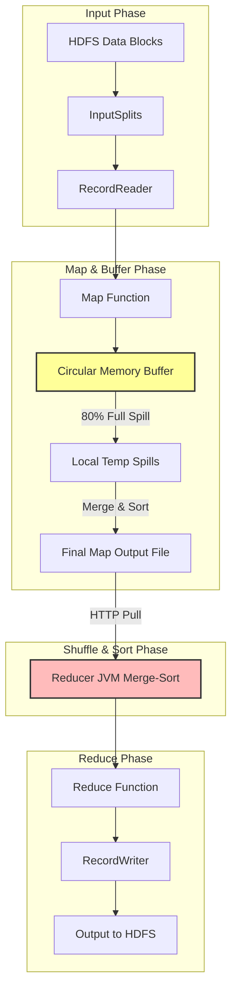

# ⚙️ Module 03: MapReduce Mastery

MapReduce is the foundational distributed computing model for processing large datasets in parallel. While modern systems use Apache Spark, understanding MapReduce internals—specifically the shuffle-and-sort phase—is essential, as it dictates how data is serialized, partitioned, and transferred across network interfaces in all distributed engines.

---

## 1. The MapReduce Execution Lifecycle

A MapReduce job splits the input dataset into independent chunks processed by map tasks in a parallel manner. The framework sorts the outputs of the maps, which are then input to the reduce tasks.



### Deep Dive into the Phases:
1. **InputFormat & InputSplit**:
   * **InputSplit**: A logical representation of data pointing to a range of bytes inside physical blocks. It is not the actual data file. One split corresponds to one Map Task.
   * **RecordReader**: Translates the logical byte range in the `InputSplit` into discrete Key-Value pairs (e.g., `LongWritable` line offsets and `Text` line contents) for the Mapper.
2. **The Mapper & Circular Buffer Internals**:
   * Each map task writes its intermediate outputs to an in-memory **Circular Memory Buffer** (default size: `100MB`, configured by `mapreduce.task.io.sort.mb`).
   * When the buffer reaches its **Spill Threshold** (default: `80%`, configured by `mapreduce.map.sort.spill.percent`), a background thread wakes up to **spill** the contents to the local disk (`mapred.local.dir`).
   * **Before Spilling**:
     1. The thread partitions the data (by hash of key modulo number of reducers).
     2. Inside each partition, the thread performs an in-memory **QuickSort** on the keys.
     3. If a **Combiner** is specified, it aggregates the sorted keys before writing to disk.
   * **Merging**: When the Map task finishes, all local spill files are merged and sorted into a single indexed map output file per mapper.
3. **The Shuffle and Sort Phase (The Bottleneck)**:
   * **Shuffle**: Reducers pull their corresponding partitions from every completed Mapper's local disk over HTTP.
   * **Sort**: As data is pulled, the Reducer JVM merges and sorts the incoming key-value streams (merge-sort).
4. **The Reducer**:
   * Calls the `reduce(Key, Iterator<Values>)` function once for each unique key.
5. **OutputFormat & RecordWriter**:
   * Serializes the reducer output and writes it to HDFS (typically creating files named `part-r-00000`).

---

## 2. Advanced Join Patterns

Distributed joins are expensive due to network traffic. Choosing the right pattern is critical.

### Map-Side Join (High Performance, No Shuffle)
* **Precondition**: One of the datasets must be small enough to fit completely into the memory of every worker node, OR both datasets must already be partitioned and sorted by the join key.
* **Mechanism**:
  1. The client distributes the small dataset to all worker nodes using the **DistributedCache**.
  2. During the setup phase of the Mapper (`setup()`), the map task reads the cached file into an in-memory lookup table (e.g., a HashMap).
  3. In the `map()` function, the mapper processes the large dataset line-by-line, performs a hash lookup against the cached map, and writes the joined record.
* **Why it's fast**: Zero network shuffle. The entire join happens locally inside the Mapper JVM.

### Reduce-Side Join (Fallback Pattern, High Shuffle)
* **Precondition**: None. Used when joining two large datasets that cannot fit in memory.
* **Mechanism**:
  1. The Mapper reads both datasets. It tags each key-value pair with a table identifier (e.g., `(Key, [TableA, ValueA])` or `(Key, [TableB, ValueB])`).
  2. The framework shuffles all records by the join key to the Reducers.
  3. The Reducer receives all values for a given key, separates them into sub-lists for Table A and Table B, and performs a Cartesian product join.
* **Why it's slow**: Shuffles every single byte across the network.

---

## 3. Distributed Cache

DistributedCache is a mechanism provided by the MapReduce framework to cache application-specific files (text files, zip files, jar files) on worker nodes so they can be accessed locally by map/reduce tasks.

### Java API Implementation Pattern:
```java
// Inside the Mapper
public static class JoinMapper extends Mapper<LongWritable, Text, Text, Text> {
    private Map<String, String> departmentMap = new HashMap<>();

    @Override
    protected void setup(Context context) throws IOException, InterruptedException {
        // Retrieve local path to cached file
        URI[] cacheFiles = context.getCacheFiles();
        if (cacheFiles != null && cacheFiles.length > 0) {
            try (BufferedReader reader = new BufferedReader(new FileReader("dict.txt"))) {
                String line;
                while ((line = reader.readLine()) != null) {
                    String[] parts = line.split(",");
                    departmentMap.put(parts[0], parts[1]); // ID -> DeptName
                }
            }
        }
    }

    @Override
    protected void map(LongWritable key, Text value, Context context) throws IOException, InterruptedException {
        // Read employee data, extract DeptID, and lookup DeptName in departmentMap
    }
}
```

---

## 4. Speculative Execution & Counters

### Speculative Execution:
* **Problem**: In a large cluster, some nodes may run slowly due to failing hard drives, network limits, or high CPU usage. These slow tasks are called **stragglers** and block the entire job from completing.
* **Solution**: If the framework detects a task running significantly slower than the average task in the job, it launches a duplicate copy of the task (**speculative task**) on a different node.
* **Resolution**: Whichever task finishes first commits its output. The framework kills the duplicate task.
* **Settings**:
  ```xml
  <!-- Enable in mapred-site.xml -->
  <property>
      <name>mapreduce.map.speculative</name>
      <value>true</value>
  </property>
  <property>
      <name>mapreduce.reduce.speculative</name>
      <value>true</value>
  </property>
  ```

### Counters:
Counters track execution statistics for diagnostics (e.g., corrupt lines, skipped rows).
```java
// Inside Mapper/Reducer
enum DataQuality {
    CORRUPT_RECORDS,
    EMPTY_LINES
}

if (record.isCorrupt()) {
    context.getCounter(DataQuality.CORRUPT_RECORDS).increment(1);
}
```

---

## 5. Complete MapReduce Reference Library

This library details the configuration properties and job diagnostics commands.

### A. Execution & Configuration Parameters (`mapred-site.xml` properties)
* **`mapreduce.task.io.sort.mb`**: Size of the circular memory buffer for map outputs (default: `100`). Increase to `256` or `512` on large memory machines to prevent excessive spilling to disk.
* **`mapreduce.map.sort.spill.percent`**: Buffer percentage threshold before launching a background spill thread (default: `0.80`).
* **`mapreduce.task.io.sort.factor`**: Max number of spill streams to merge at once during sorting (default: `10`). Increase to `100` to speed up merge cycles.
* **`mapreduce.job.reduces`**: Number of reducer tasks to launch for a job (default: `1`). In production, configure equal to \(1.75 \times \text{number of nodes} \times \text{vcores per node}\).
* **`mapreduce.map.memory.mb`**: Memory container size allocated by YARN for a map task (default: `1024`).
* **`mapreduce.reduce.memory.mb`**: Memory container size allocated by YARN for a reduce task (default: `1024`).
* **`mapreduce.map.java.opts`**: JVM heap arguments for mapper. Must be smaller than `map.memory.mb` (usually ~80% of container size, e.g. `-Xmx800m`).
* **`mapreduce.reduce.java.opts`**: JVM heap arguments for reducer. (e.g. `-Xmx800m`).

### B. Job Management & Execution CLI
* **`hadoop jar`**: Run custom jar packages.
  * `hadoop jar wordcount.jar com.company.WordCount -D mapreduce.job.reduces=4 /input /output`: Submit job, overriding reducer task count to 4.
* **`mapred job`**: Administer and query jobs on the cluster.
  * `mapred job -list`: List active jobs.
  * `mapred job -list all`: List all historical jobs.
  * `mapred job -status <job-id>`: Print details of a job, showing map/reduce percentage progress and JVM counters.
  * `mapred job -kill <job-id>`: Terminate job execution.
  * `mapred job -set-priority <job-id> HIGH`: Change YARN scheduling priority of the job.
  * `mapred job -history <dir>`: Extract historical execution records from job history server files.

---

## 6. Enterprise Job Interview Q&A (MapReduce)

This section prepares you for production-level interview questions.

### Q1: What is the Shuffle and Sort phase in MapReduce, and how do we tune its memory configurations to prevent local disk IO bottlenecks?
* **How to explain this to the interviewer**:
  Clearly describe the physical flow of data from the mapper memory to local disk, the HTTP transfers, and the reducer merge-sort. Then explain *which* specific configurations to change to keep data in-memory longer.

* **Model Answer**:
  "The Shuffle and Sort phase is the process of moving intermediate data from the mappers to the reducers. 
  
  Mappers write their outputs to an in-memory circular buffer (`mapreduce.task.io.sort.mb`, default 100MB). When it reaches 80% capacity (`mapreduce.map.sort.spill.percent`), a background thread sorts the data by partition and key, and writes a spill file to the local disk. When the map task finishes, all individual spills are merged and sorted into one master output file. The Reducer pulls its corresponding key partition over HTTP and merges it (using merge-sort) in memory before passing it to the reduce function.
  
  To tune and prevent disk IO bottlenecks:
  1. I increase the circular buffer size to `256MB` or `512MB` (`mapreduce.task.io.sort.mb`). This allows larger volumes of data to be sorted in memory, minimizing the number of intermediate files written to disk.
  2. I increase the merge factor (`mapreduce.task.io.sort.factor`) from the default `10` to `100`. This allows the merger thread to consolidate up to 100 spill files in a single pass, drastically reducing merge read/write cycles.
  3. I allocate larger JVM heaps using `mapreduce.map.java.opts` to prevent Out-of-Memory exceptions on executors during sorting."

---

### Q2: What is a Map-Side Join, how does it use the DistributedCache, and what are its key limitations?
* **How to explain this to the interviewer**:
  Start by stating that it is a join that occurs entirely in the map phase without a shuffle stage. Explain the role of the DistributedCache in sending the small table to memory and contrast it with a standard join.

* **Model Answer**:
  "A Map-Side Join joins two tables entirely in the mapper phase without forcing a network shuffle. 
  
  To implement it, the smaller table (lookup metadata) is sent to all worker nodes via the **DistributedCache** (`-files` option in CLI). In the mapper's `setup()` method, the task reads this cached file from the local OS path and loads it into a standard JVM `HashMap` structure. In the `map()` method, the task streams the large table line-by-line, parses the join key, looks up matching fields in the HashMap, and writes the output.
  
  **Limitations**:
  1. The small table must fit entirely in the mapper JVM heap memory. If it is too large, the mapper crashes with a `java.lang.OutOfMemoryError`.
  2. If joining two large tables, we cannot use this approach. We must use a **Reduce-Side Join**, which shuffles both tables by the join key to the reducers, introducing severe network latency."

---

### Q3: What is a Combiner? Why is it called a 'Local Reducer' and why is it not always safe to use? Provide a specific mathematical example.
* **How to explain this to the interviewer**:
  Define the combiner's purpose (local aggregation to reduce network traffic on writes). Then use the mathematical average calculation to show why it is not commutative and associative, leading to corrupt results if used incorrectly.

* **Model Answer**:
  "A **Combiner** is an optional class that runs on the mapper node before data is shuffled. It aggregates the mapper output values locally, reducing the number of key-value pairs transferred across the network to the reducers.
  
  It is only safe to use if the aggregation function is **associative** (\(A + (B + C) = (A + B) + C\)) and **commutative** (\(A + B = B + A\)).
  
  **Why it is unsafe for Average calculations**:
  Suppose a mapper has two partitions yielding data:
  * Partition 1: `(Key, 10)`, `(Key, 20)`
  * Partition 2: `(Key, 30)`, `(Key, 40)`, `(Key, 50)`
  
  * **Without Combiner**: The reducer receives all 5 records: `(Key, [10, 20, 30, 40, 50])`. 
    Correct Average = \((10 + 20 + 30 + 40 + 50) / 5 = 150 / 5 = 30\).
  
  * **With Combiner**:
    * Combiner 1 runs on Partition 1: Average = \((10 + 20) / 2 = 15\). Output: `(Key, 15)`.
    * Combiner 2 runs on Partition 2: Average = \((30 + 40 + 50) / 3 = 40\). Output: `(Key, 40)`.
    * Reducer receives intermediate averages: `(Key, [15, 40])`.
    * Reducer calculates average of averages = \((15 + 40) / 2 = 27.5\).
  
  The result `27.5` is mathematically incorrect. Therefore, a Combiner cannot be used for `Average` calculations."
