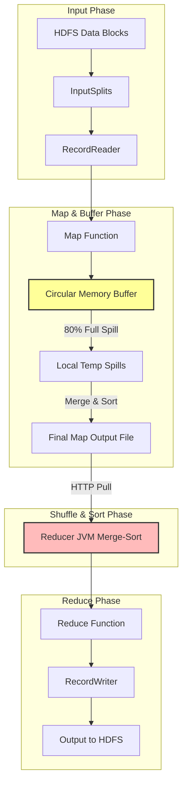

# ⚙️ Module 03: MapReduce Mastery

MapReduce is the foundational distributed computing model for processing large datasets in parallel. While modern systems use Apache Spark, understanding MapReduce internals—specifically the shuffle-and-sort phase—is essential, as it dictates how data is serialized, partitioned, and transferred across network interfaces in all distributed engines.

---

## 1. The MapReduce Execution Lifecycle

A MapReduce job splits the input dataset into independent chunks processed by map tasks in a parallel manner. The framework sorts the outputs of the maps, which are then input to the reduce tasks.



### Deep Dive into the Phases:
1. **InputFormat & InputSplit**:
   * **InputSplit**: A logical representation of data pointing to a range of bytes inside physical blocks. It is not the actual data file. One split corresponds to one Map Task.
   * **RecordReader**: Translates the logical byte range in the `InputSplit` into discrete Key-Value pairs (e.g., `LongWritable` line offsets and `Text` line contents) for the Mapper.
2. **The Mapper & Circular Buffer Internals**:
   * Each map task writes its intermediate outputs to an in-memory **Circular Memory Buffer** (default size: `100MB`, configured by `mapreduce.task.io.sort.mb`).
   * When the buffer reaches its **Spill Threshold** (default: `80%`, configured by `mapreduce.map.sort.spill.percent`), a background thread wakes up to **spill** the contents to the local disk (`mapred.local.dir`).
   * **Before Spilling**:
     1. The thread partitions the data (by hash of key modulo number of reducers).
     2. Inside each partition, the thread performs an in-memory **QuickSort** on the keys.
     3. If a **Combiner** is specified, it aggregates the sorted keys before writing to disk.
   * **Merging**: When the Map task finishes, all local spill files are merged and sorted into a single indexed map output file per mapper.
3. **The Shuffle and Sort Phase (The Bottleneck)**:
   * **Shuffle**: Reducers pull their corresponding partitions from every completed Mapper's local disk over HTTP.
   * **Sort**: As data is pulled, the Reducer JVM merges and sorts the incoming key-value streams (merge-sort).
4. **The Reducer**:
   * Calls the `reduce(Key, Iterator<Values>)` function once for each unique key.
5. **OutputFormat & RecordWriter**:
   * Serializes the reducer output and writes it to HDFS (typically creating files named `part-r-00000`).

---

## 2. Advanced Join Patterns

Distributed joins are expensive due to network traffic. Choosing the right pattern is critical.

### Map-Side Join (High Performance, No Shuffle)
* **Precondition**: One of the datasets must be small enough to fit completely into the memory of every worker node, OR both datasets must already be partitioned and sorted by the join key.
* **Mechanism**:
  1. The client distributes the small dataset to all worker nodes using the **DistributedCache**.
  2. During the setup phase of the Mapper (`setup()`), the map task reads the cached file into an in-memory lookup table (e.g., a HashMap).
  3. In the `map()` function, the mapper processes the large dataset line-by-line, performs a hash lookup against the cached map, and writes the joined record.
* **Why it's fast**: Zero network shuffle. The entire join happens locally inside the Mapper JVM.

### Reduce-Side Join (Fallback Pattern, High Shuffle)
* **Precondition**: None. Used when joining two large datasets that cannot fit in memory.
* **Mechanism**:
  1. The Mapper reads both datasets. It tags each key-value pair with a table identifier (e.g., `(Key, [TableA, ValueA])` or `(Key, [TableB, ValueB])`).
  2. The framework shuffles all records by the join key to the Reducers.
  3. The Reducer receives all values for a given key, separates them into sub-lists for Table A and Table B, and performs a Cartesian product join.
* **Why it's slow**: Shuffles every single byte across the network.

---

## 3. Distributed Cache

DistributedCache is a mechanism provided by the MapReduce framework to cache application-specific files (text files, zip files, jar files) on worker nodes so they can be accessed locally by map/reduce tasks.

### CLI Usage:
```bash
# Submit a job caching a dictionary file located in HDFS for map-side joins
hadoop jar myjobs.jar JoinDriver -files hdfs://namenode:9000/data/dict.txt /input /output
```

### Java API Implementation Pattern:
```java
// Inside the Mapper
public static class JoinMapper extends Mapper<LongWritable, Text, Text, Text> {
    private Map<String, String> departmentMap = new HashMap<>();

    @Override
    protected void setup(Context context) throws IOException, InterruptedException {
        // Retrieve local path to cached file
        URI[] cacheFiles = context.getCacheFiles();
        if (cacheFiles != null && cacheFiles.length > 0) {
            try (BufferedReader reader = new BufferedReader(new FileReader("dict.txt"))) {
                String line;
                while ((line = reader.readLine()) != null) {
                    String[] parts = line.split(",");
                    departmentMap.put(parts[0], parts[1]); // ID -> DeptName
                }
            }
        }
    }

    @Override
    protected void map(LongWritable key, Text value, Context context) throws IOException, InterruptedException {
        // Read employee data, extract DeptID, and lookup DeptName in departmentMap
    }
}
```

---

## 4. Speculative Execution & Counters

### Speculative Execution:
* **Problem**: In a large cluster, some nodes may run slowly due to failing hard drives, network limits, or high CPU usage. These slow tasks are called **stragglers** and block the entire job from completing.
* **Solution**: If the framework detects a task running significantly slower than the average task in the job, it launches a duplicate copy of the task (**speculative task**) on a different node.
* **Resolution**: Whichever task finishes first commits its output. The framework kills the duplicate task.
* **Settings**:
  ```xml
  <!-- Enable in mapred-site.xml -->
  <property>
      <name>mapreduce.map.speculative</name>
      <value>true</value>
  </property>
  <property>
      <name>mapreduce.reduce.speculative</name>
      <value>true</value>
  </property>
  ```

### Counters:
Counters track execution statistics for diagnostics (e.g., corrupt lines, skipped rows).
```java
// Inside Mapper/Reducer
enum DataQuality {
    CORRUPT_RECORDS,
    EMPTY_LINES
}

if (record.isCorrupt()) {
    context.getCounter(DataQuality.CORRUPT_RECORDS).increment(1);
}
```

---

## 5. Administrative & Diagnostics CLI

```bash
# List all active and completed MapReduce jobs
mapred job -list all

# Kill a running job
mapred job -kill job_1688192837311_0001

# Check the status of a specific job
mapred job -status job_1688192837311_0001

# View specific counters for a completed job
mapred job -counter job_1688192837311_0001 "DataQuality" "CORRUPT_RECORDS"
```

---

## 🎯 Exam and Interview Traps

1. **Trap: What is the difference between an InputSplit and an HDFS Block?**
   * **Answer**: An HDFS Block is a physical unit of storage (e.g., a 128MB file chunk on disk). An `InputSplit` is a logical boundary containing reference offsets, which the mapper reads. A split can span block boundaries. If an `InputSplit` spans two blocks, the RecordReader fetches the trailing record portion from the remote DataNode over the network, which violates data locality.

2. **Trap: Why does a MapReduce job fail with disk space errors even when HDFS has terabytes of free space?**
   * **Answer**: HDFS space is irrelevant for Mapper intermediate files. Mappers write their circular buffer spills directly to the **local disk** of the worker nodes (`mapred.local.dir` or `/tmp`). If worker nodes have small local drives, the shuffle stage will fail with local storage out-of-space issues.

3. **Trap: Why is using a Combiner not always safe?**
   * **Answer**: The Combiner operates as a local reducer, executing before data is shuffled. It is only safe to use if the reduction operation is **associative** and **commutative**. 
     * *Safe*: Sum, Min, Max, Count.
     * *Unsafe*: Average. A combiner calculating the average of local splits will result in mathematically incorrect averages when the reducer merges them.
