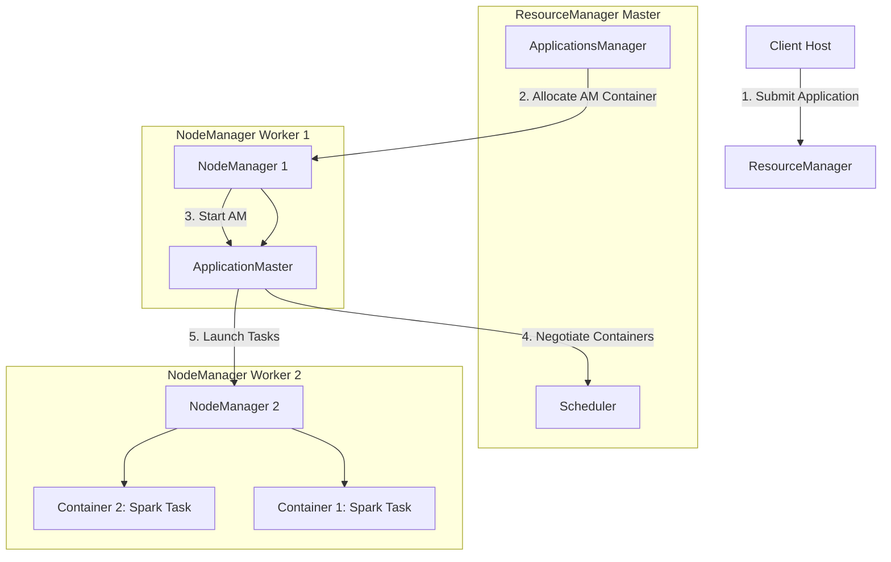

# 🧭 Module 04: YARN Resource Manager Mastery

YARN (Yet Another Resource Negotiator) is the architectural cluster operating system of Hadoop. It separates the storage layer (HDFS) from the execution engines, serving as the central resource manager that schedules and allocates memory, CPU, and network resource slices (Containers) to multiple execution engines (MapReduce, Spark, Hive, Flink) running concurrently on the cluster.

---

## 1. YARN Architectural Components & Job Execution Flow

YARN uses a master-slave design consisting of a central resource negotiator and distributed worker daemons.



### Components Detailed:
* **ResourceManager (RM)**: The master daemon.
  * **Scheduler**: Responsible for allocating resource slots to running applications according to queue capacities and constraints. It performs no monitoring or tracking of application status.
  * **ApplicationsManager (ASM)**: Accepts job submissions, negotiates the first container to execute the application-specific **ApplicationMaster (AM)**, and provides service restart capability if the AM fails.
* **NodeManager (NM)**: The agent daemon running on each worker host. It monitors resource usage (memory, CPU, disk, network) of local containers and reports them to the ResourceManager.
* **ApplicationMaster (AM)**: A framework-specific library daemon (e.g., Spark Driver, MapReduce ApplicationMaster) that runs inside a container. It negotiates resource containers from the RM scheduler and communicates with NodeManagers to execute and monitor tasks.
* **Container**: A logical allocation of physical resources (e.g., `4GB RAM`, `2 vCores`) on a single node. Tasks run inside these isolated worker containers.

---

## 2. Resource Schedulers (Capacity vs. Fair)

In multi-tenant enterprise environments, resources must be shared fairly among departments (e.g., Finance, Marketing, Data Science).

### Capacity Scheduler (Default)
Designed for multi-tenant sharing where groups are allocated specific queues with fixed resource percentages.
* **Hierarchical Queues**: Resources are split into structures like `root.finance` (60%) and `root.marketing` (40%).
* **Elastic Capacity**: If `root.marketing` is idle, `root.finance` can borrow its resources up to a configured limit (`maximum-capacity`). If marketing starts jobs, finance containers are slowly returned (gracefully shut down or preempted).
* **Guarantees**: Ensures each department has a guaranteed minimum share of the cluster.

### Fair Scheduler
Designed to share cluster resources equally among running applications.
* **Equal Split**: If one job runs, it takes 100% of the cluster. If a second job starts, each job gets 50%.
* **Dominant Resource Fairness (DRF)**: Allocates resources based on multiple resource types (CPU-bound vs. memory-bound tasks).
* **Preemption**: If a queue is starved of its fair share, the scheduler can kill running containers from over-allocated queues to free up resources immediately.

---

## 3. Resource Allocation Tuning Math

Tuning YARN memory and CPU variables prevents Spark executors and Hadoop map tasks from being killed by the NodeManager.

### Key Configuration Parameters (`yarn-site.xml`):
* **`yarn.nodemanager.resource.memory-mb`**: The total physical memory (in MB) allocated on a single worker node for YARN containers.
  * *Formula*: Node RAM - OS RAM reserve - DataNode RAM reserve.
  * *Example*: On a 64GB RAM node, allocate 8GB for OS and 4GB for HDFS DataNode. Set this to `53248` (52GB).
* **`yarn.nodemanager.resource.cpu-vcores`**: The total virtual CPU cores allocated on a single node.
  * *Tuning*: Typically set equal to physical CPU cores, or scaled up to \(1.5 \times \text{physical cores}\) if CPU utilization is low.
* **`yarn.scheduler.minimum-allocation-mb`**: The minimum memory block a container can request. Requests are rounded up to multiples of this value.
* **`yarn.scheduler.maximum-allocation-mb`**: The maximum memory a single container can request (e.g., set to matching `yarn.nodemanager.resource.memory-mb`).
* **`yarn.nodemanager.vmem-pmem-ratio`**: Virtual to physical memory ratio. Default is `2.1`.
  * *Meaning*: A container requesting 2GB physical RAM is allowed to use up to 4.2GB virtual memory. If exceeded, the NodeManager kills the container.

---

## 4. Complete YARN CLI Reference Library

This library details all YARN job query, node tracking, queue allocation, and administrative commands.

### A. YARN Application Management (`yarn application`)
* **`-list`**: List submitted applications.
  * `yarn application -list`: List active applications.
  * `yarn application -list -appStates FINISHED,KILLED,FAILED`: List completed applications.
  * `yarn application -list -appTypes SPARK`: Filter applications by type.
* **`-status`**: Query application details.
  * `yarn application -status application_1688192837311_0005`: Displays metadata, diagnostics, tracking URL, and resource utilization.
* **`-kill`**: Force terminate a job.
  * `yarn application -kill application_1688192837311_0005`
* **`-movetoqueue`**: Move a running application to another queue.
  * `yarn application -movetoqueue application_1688192837311_0005 -queue root.finance`

### B. YARN Node Management (`yarn node`)
* **`-list`**: Print active node statuses.
  * `yarn node -list`: Shows host addresses, states, active containers, memory, and CPU limits.
  * `yarn node -list -states RUNNING,UNHEALTHY`: Filter nodes.
* **`-status`**: Detailed node report.
  * `yarn node -status worker-node-1:45454`

### C. Queue Diagnostics (`yarn queue`)
* **`-status`**: Query allocation of a specific queue.
  * `yarn queue -status root.default`: Shows absolute capacity, current capacity, state, and child queues.

### D. Log Extraction & Diagnostics (`yarn logs`)
* **`yarn logs -applicationId <app-id>`**: Dumps all aggregated log files (from stdout, stderr, syslog) from all executors distributed across the cluster nodes.
* **`yarn logs -applicationId <app-id> -containerId <container-id>`**: Retrieve logs for a specific task container.
* **`yarn logs -applicationId <app-id> -nodeAddress <node-ip:port>`**: Retrieve logs written on a specific worker node.

### E. Resource Manager Administration (`yarn rmadmin`)
* **`-refreshQueues`**: Re-load YARN scheduler configurations (`capacity-scheduler.xml`) without restarting the ResourceManager.
* **`-refreshNodes`**: Re-read inclusion/exclusion file paths for NodeManagers (for decommissioning hosts).
* **`-getServiceState`**: Check Active/Standby status in HA configuration.
  * `yarn rmadmin -getServiceState rm1`
* **`-transitionToActive` / `-transitionToStandby`**: Manually force state change.
  * `yarn rmadmin -transitionToActive rm1 --forceactive`

---

## 5. Enterprise Job Interview Q&A (YARN)

This section prepares you for production-level interview questions.

### Q1: Describe the step-by-step lifecycle of a YARN job. Also, explain the difference between Spark client mode and Spark cluster mode under YARN.
* **How to explain this to the interviewer**:
  Start by walking through the handshake between the client, ASM, and the first container (AM). Then, explain the container request loop. Finally, clarify that the key difference between Client and Cluster modes is where the Driver process physically runs.

* **Model Answer**:
  "When a client submits an application:
  1. The client connects to the ResourceManager (RM) ApplicationsManager (ASM) and requests an Application ID.
  2. The ASM allocates a container on a NodeManager (NM) and starts the framework-specific **ApplicationMaster (AM)**.
  3. The AM initializes, registers with the RM Scheduler, and determines its resource needs.
  4. The AM submits resource requests (vCores, Memory) to the RM Scheduler.
  5. Once containers are allocated on NMs, the AM connects to those NMs and launches task processes (e.g. Spark Executors).
  6. The tasks report status back to the AM. When complete, the AM unregisters from the RM and shuts down.
  
  **Difference between Client and Cluster modes (e.g. in Spark)**:
  * In **Client Mode**, the Spark Driver process runs locally on the client host machine that submitted the job. The YARN container only hosts the Executor processes. The AM in the container acts solely as a helper to request resources from YARN. If the client machine shuts down or loses connection, the job dies. Used for interactive analysis (e.g., notebook shells).
  * In **Cluster Mode**, the Spark Driver process runs inside the YARN ApplicationMaster container allocated on a worker node. The client machine can disconnect immediately after submission. The driver is hosted safely inside the cluster with restart tolerance. Used for production batch jobs."

---

### Q2: What is the YARN container sizing formula, and how do you calculate the optimal memory/CPU properties for worker nodes?
* **How to explain this to the interviewer**:
  Do not just list XML tags. Walk the interviewer through the exact subtraction math (total RAM minus OS reserve, minus DataNode reserve) to arrive at the container increments.

* **Model Answer**:
  "The container sizing formula requires reserving memory for the operating system and Hadoop master/worker daemons first to prevent kernel out-of-memory crashes.
  
  Let's assume a physical node has **64 GB RAM** and **16 Cores**:
  1. **OS Reserve**: We allocate `8GB` for OS memory, disk page cache, and SSH utilities.
  2. **Daemon Reserve**: We allocate `4GB` for the HDFS DataNode JVM and NodeManager JVM combined.
  3. **YARN Memory Allocation**: \(64\text{ GB} - 12\text{ GB} = 52\text{ GB}\). We set `yarn.nodemanager.resource.memory-mb` to `53248` (in MB).
  4. **YARN CPU Allocation**: We allocate 16 vCores: `yarn.nodemanager.resource.cpu-vcores = 16`.
  5. **Container Boundaries**:
     * We set `yarn.scheduler.minimum-allocation-mb = 2048` (2GB).
     * We set `yarn.scheduler.maximum-allocation-mb = 53248` (52GB).
  
  If we run Spark executors, we set each executor container to request `4 vCores` and `12GB` RAM. This allows us to run up to 4 executors per node securely without causing thrashing."

---

### Q3: What is YARN Queue Preemption, and how does it prevent resource starvation in multi-tenant environments?
* **How to explain this to the interviewer**:
  Explain what happens when a queue is over-allocated and another queue suddenly requests resources. Then detail how preemption forces the release of resources, and how it is configured.

* **Model Answer**:
  "YARN Queue Preemption is a feature of the Capacity and Fair Schedulers. It resolves the problem of resource hogging. 
  
  If Queue A (e.g. Marketing, 30% capacity) is idle, and Queue B (e.g. Data Science, 70% capacity) submits a large job, YARN allows Queue B to borrow Queue A's unused capacity and run jobs on 100% of the cluster. However, if Queue A suddenly submits a high-priority job, it will experience **starvation** because all containers are occupied by Queue B's tasks.
  
  With **Preemption enabled**:
  1. YARN monitors queue guarantees. It notices Queue A is starved of its 30% allocation.
  2. YARN asks Queue B to gracefully release containers.
  3. If Queue B does not terminate its tasks within a specific timeout (`yarn.resourcemanager.monitor.capacity-scheduler.preemption.grace_period`), the ResourceManager kills Queue B's containers forcefully and re-allocates them to Queue A.
  
  To configure this in `yarn-site.xml`, we enable the scheduling monitor:
  ```xml
  <property>
      <name>yarn.resourcemanager.scheduler.monitor.enable</name>
      <value>true</value>
  </property>
  ```
  And specify the default preemption policy class."
