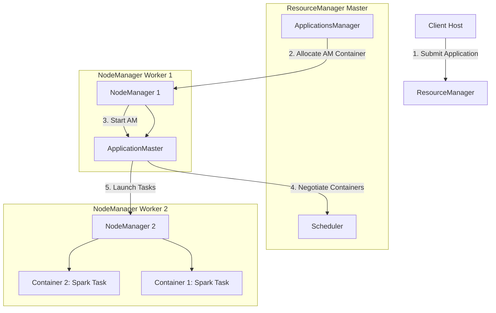

# 🧭 Module 04: YARN Resource Manager Mastery

YARN (Yet Another Resource Negotiator) is the architectural cluster operating system of Hadoop. It separates the storage layer (HDFS) from the execution engines, serving as the central resource manager that schedules and allocates memory, CPU, and network resource slices (Containers) to multiple execution engines (MapReduce, Spark, Hive, Flink) running concurrently on the cluster.

---

## 1. YARN Architectural Components & Job Execution Flow

YARN uses a master-slave design consisting of a central resource negotiator and distributed worker daemons.



### Components Detailed:
* **ResourceManager (RM)**: The master daemon.
  * **Scheduler**: Responsible for allocating resource slots to running applications according to queue capacities and constraints. It performs no monitoring or tracking of application status.
  * **ApplicationsManager (ASM)**: Accepts job submissions, negotiates the first container to execute the application-specific **ApplicationMaster (AM)**, and provides service restart capability if the AM fails.
* **NodeManager (NM)**: The agent daemon running on each worker host. It monitors resource usage (memory, CPU, disk, network) of local containers and reports them to the ResourceManager.
* **ApplicationMaster (AM)**: A framework-specific library daemon (e.g., Spark Driver, MapReduce ApplicationMaster) that runs inside a container. It negotiates resource containers from the RM scheduler and communicates with NodeManagers to execute and monitor tasks.
* **Container**: A logical allocation of physical resources (e.g., `4GB RAM`, `2 vCores`) on a single node. Tasks run inside these isolated worker containers.

---

## 2. Resource Schedulers (Capacity vs. Fair)

In multi-tenant enterprise environments, resources must be shared fairly among departments (e.g., Finance, Marketing, Data Science).

### Capacity Scheduler (Default)
Designed for multi-tenant sharing where groups are allocated specific queues with fixed resource percentages.
* **Hierarchical Queues**: Resources are split into structures like `root.finance` (60%) and `root.marketing` (40%).
* **Elastic Capacity**: If `root.marketing` is idle, `root.finance` can borrow its resources up to a configured limit (`maximum-capacity`). If marketing starts jobs, finance containers are slowly returned (gracefully shut down or preempted).
* **Guarantees**: Ensures each department has a guaranteed minimum share of the cluster.

### Fair Scheduler
Designed to share cluster resources equally among running applications.
* **Equal Split**: If one job runs, it takes 100% of the cluster. If a second job starts, each job gets 50%.
* **Dominant Resource Fairness (DRF)**: Allocates resources based on multiple resource types (CPU-bound vs. memory-bound tasks).
* **Preemption**: If a queue is starved of its fair share, the scheduler can kill running containers from over-allocated queues to free up resources immediately.

---

## 3. Resource Allocation Tuning Math

Tuning YARN memory and CPU variables prevents Spark executors and Hadoop map tasks from being killed by the NodeManager.

### Key Configuration Parameters (`yarn-site.xml`):
* **`yarn.nodemanager.resource.memory-mb`**: The total physical memory (in MB) allocated on a single worker node for YARN containers.
  * *Formula*: Node RAM - OS RAM reserve - DataNode RAM reserve.
  * *Example*: On a 64GB RAM node, allocate 8GB for OS and 4GB for HDFS DataNode. Set this to `53248` (52GB).
* **`yarn.nodemanager.resource.cpu-vcores`**: The total virtual CPU cores allocated on a single node.
  * *Tuning*: Typically set equal to physical CPU cores, or scaled up to \(1.5 \times \text{physical cores}\) if CPU utilization is low.
* **`yarn.scheduler.minimum-allocation-mb`**: The minimum memory block a container can request. Requests are rounded up to multiples of this value.
* **`yarn.scheduler.maximum-allocation-mb`**: The maximum memory a single container can request (e.g., set to matching `yarn.nodemanager.resource.memory-mb`).
* **`yarn.nodemanager.vmem-pmem-ratio`**: Virtual to physical memory ratio. Default is `2.1`.
  * *Meaning*: A container requesting 2GB physical RAM is allowed to use up to 4.2GB virtual memory. If exceeded, the NodeManager kills the container.

---

## 4. Resource Calculation Example (Designing a Cluster Node)

Imagine a node with **128 GB RAM** and **32 Physical Cores**. Let's calculate the YARN configuration parameters:

1. **System Overhead Reserves**:
   * Operating System: **16 GB**
   * Hadoop Daemons (DataNode + NodeManager): **8 GB**
   * Available for YARN: \(128\text{ GB} - 24\text{ GB} = 104\text{ GB}\)
2. **YARN Configurations**:
   ```xml
   <!-- Total RAM for YARN containers on this host: 104 GB -->
   <property>
       <name>yarn.nodemanager.resource.memory-mb</name>
       <value>106496</value>
   </property>

   <!-- Total Cores for YARN containers: 32 -->
   <property>
       <name>yarn.nodemanager.resource.cpu-vcores</name>
       <value>32</value>
   </property>

   <!-- Minimum container allocation: 2 GB -->
   <property>
       <name>yarn.scheduler.minimum-allocation-mb</name>
       <value>2048</value>
   </property>

   <!-- Maximum container allocation: 104 GB -->
   <property>
       <name>yarn.scheduler.maximum-allocation-mb</name>
       <value>106496</value>
   </property>
   ```

---

## 5. Diagnostic & Monitoring CLI Commands

When applications hang or fail, use the YARN CLI to inspect queues, kill jobs, and extract aggregated log files.

```bash
# List all running YARN applications
yarn application -list

# Filter applications by state (RUNNING, SUBMITTED, ACCEPTED, KILLED, FAILED, FINISHED)
yarn application -list -appStates RUNNING

# Get status of a specific application (shows AM host, tracking URL, and resource usage)
yarn application -status application_1688192837311_0005

# Kill a stuck application
yarn application -kill application_1688192837311_0005

# Check resource status of all active cluster nodes
yarn node -list -all

# Display resource details of the queue hierarchy
yarn queue -status root.default

# Extract logs of a completed application (Requires Log Aggregation enabled)
yarn logs -applicationId application_1688192837311_0005 > app_execution.log
```

---

## 🎯 Exam and Interview Traps

1. **Trap: Why does my Spark job fail with "Container killed by YARN for exceeding memory limits. 4.1 GB of 4.0 GB physical memory used"?**
   * **Answer**: YARN monitors container physical memory usage. In Java/Scala/Python applications, overhead memory (off-heap memory, thread stacks, Python processes in PySpark) is allocated outside the JVM heap. If the sum of heap + off-heap exceeds the container allocation request, NodeManager kills it. Fix this by increasing `spark.executor.memoryOverhead` or allocating larger memory limits via YARN configs.

2. **Trap: Why is my YARN application stuck in the `ACCEPTED` state and not moving to `RUNNING`?**
   * **Answer**: This is a classic "Queue Starvation" issue. It occurs when:
     1. The queue resource capacity is fully occupied by other running jobs.
     2. The cluster is out of memory to allocate a container for the application's **ApplicationMaster (AM)**. If AMs occupy too much of the queue capacity, new jobs cannot start. Adjust `yarn.scheduler.capacity.maximum-am-resource-percent` (default is 10-20%) to limit the resources consumed by ApplicationMasters.

3. **Trap: Why is it bad to disable `yarn.nodemanager.vmem-check-enabled`?**
   * **Answer**: Disabling it stops NodeManager from killing containers that exceed virtual memory limits (which often happen on Linux due to aggressive allocation behaviors in JVMs). However, while disabling the vmem check prevents premature job crashes, it can lead to OS swap usage or system-wide Out-of-Memory crashes if physical memory is exhausted. Set `yarn.nodemanager.vmem-pmem-ratio` to a higher value (e.g. `3.0` or `5.0`) instead of disabling the check completely.
