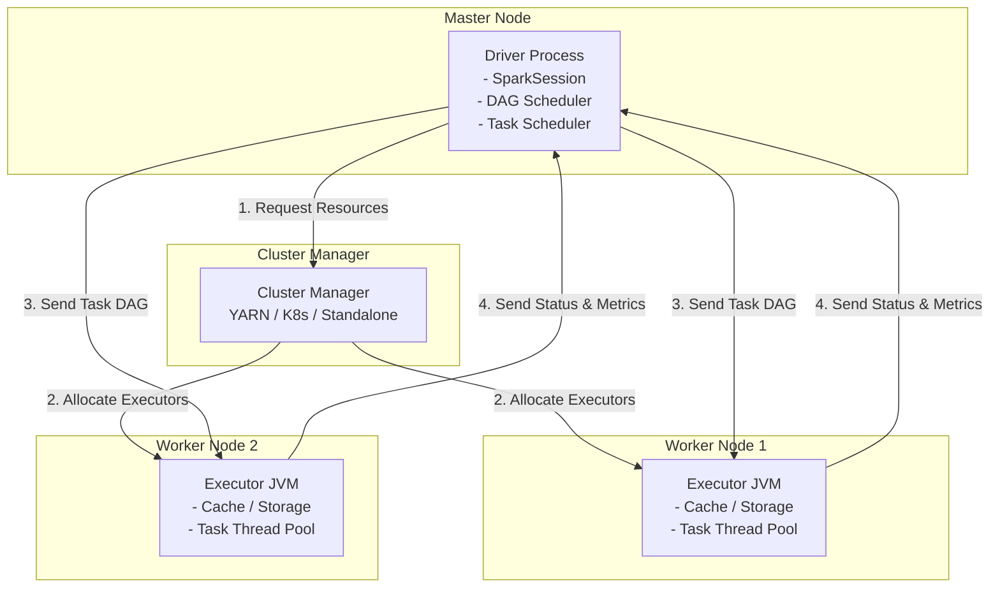

# ✨ Module 06: Apache Spark Core & SQL Mastery

Apache Spark is a unified, in-memory distributed analytics engine designed for large-scale data processing. Unlike legacy disk-bound frameworks (MapReduce), Spark executes operations in memory using a directed acyclic graph (DAG) execution engine, making it up to 100x faster for iterative algorithms and complex workflows.

---

## 1. Spark Cluster Architecture & Execution Model

Spark uses a Master-Slave architecture containing a coordinator process (Driver) and distributed worker nodes (Executors).



### Components Detailed:
* **Driver Program**: The orchestrator of the Spark application.
  * Creates the `SparkSession` (the entry point).
  * Converts developer code into a **Directed Acyclic Graph (DAG)** of operations.
  * Splits the DAG into logical execution **Stages**.
  * Schedules and distributes individual executable units (**Tasks**) to Executors.
* **Executor**: Worker JVM processes launched on cluster nodes.
  * Runs the tasks assigned by the driver using a thread pool.
  * Stores data cached by the user in-memory or on disk (BlockManager).
  * Reports task completion status and performance metrics back to the driver.

---

## 2. The DAG: Stages, Tasks, and Transformations

Spark builds a logical graph of executions called the Lineage Graph. Execution is deferred until an **Action** is invoked (Lazy Evaluation).

### Transformations vs. Actions:
* **Transformations**: Read or manipulate data, producing a new RDD/DataFrame. They are lazily evaluated.
  * *Narrow Transformations*: The child partition depends on a single parent partition (e.g., `map()`, `filter()`, `flatMap()`). These do not require network shuffles and execute within the same stage.
  * *Wide Transformations*: The child partition depends on multiple parent partitions (e.g., `groupByKey()`, `reduceByKey()`, `join()`, `repartition()`). These force a **Shuffle Boundary**, ending the current stage and spawning a new stage.
* **Actions**: Trigger the evaluation of all recorded transformations and return results to the driver or write data to HDFS/S3 (e.g., `collect()`, `count()`, `saveAsTextFile()`).

```mermaid
flowchart LR
    subgraph Stage 1 (Narrow)
        R1[Read File] --> T1[Filter]
        T1 --> T2[Map]
    end
    
    T2 -- Wide Shuffle (Repartition) --> Stage2
    
    subgraph Stage 2 (Wide)
        Stage2[ReduceByKey] --> Action[Save / Output]
    end
    
    style T2 fill:#fbb,stroke:#333
    style Stage2 fill:#fbb,stroke:#333
```

---

## 3. RDD vs. DataFrame vs. Dataset

| Feature | RDD (Resilient Distributed Dataset) | DataFrame | Dataset |
| :--- | :--- | :--- | :--- |
| **API Type** | Low-level object API. | Declarative relational API. | Strongly-typed object API. |
| **Data Representation** | JVM Java/Scala Objects. | Rows of Spark SQL Schema. | Typed JVM Case Classes. |
| **Type Safety** | Compile-time safe. | Runtime safe (No schema check at compile time). | Compile-time safe. |
| **Optimizer Integration** | None (Runs user code as-is). | Highly optimized via Catalyst & Tungsten. | Optimized (with JVM serialization overhead). |
| **Language Support** | Scala, Java, Python, R. | Scala, Java, Python, R. | Scala and Java only. |

---

## 4. Spark Optimization Engines: Catalyst & Tungsten

Modern Spark (DataFrame/Dataset APIs) achieves performance via two core engines.

### The Catalyst Optimizer:
An extensible query optimizer for Spark SQL and DataFrame operations. It goes through four phases:
1. **Analysis**: Resolves column and table names against the catalog metadata.
2. **Logical Optimization**: Applies rule-based optimizations such as **Constant Folding** and **Predicate Pushdown**.
3. **Physical Planning**: Generates multiple physical execution strategies and selects the cheapest option using a Cost Model.
4. **Code Generation**: Generates Java bytecode at runtime for execution on worker nodes.

### The Tungsten Engine:
Focuses on physical hardware optimization:
* **Off-Heap Memory Management**: Bypasses the JVM heap and GC overhead by allocating and managing memory directly inside raw byte arrays using an off-heap memory manager.
* **Cache-Aware Computation**: Designs algorithms (like sorting and hashing) that fit directly into L1/L2/L3 CPU cache lines to avoid waiting for RAM access.
* **Whole-Stage Code Generation**: Flattens nested expressions into a single, clean loop in bytecode, eliminating virtual function calls.

---

## 5. Distributed Join Strategies

Spark selects join strategies dynamically based on table size, join keys, and partition setups.

### 1. Broadcast Hash Join (BHJ)
* **Precondition**: One of the datasets must be small (default: `<10MB`, configured by `spark.sql.autoBroadcastJoinThreshold`).
* **Mechanism**: Spark copies (broadcasts) the small dataset to the memory of all executor nodes. Each executor loads it into a hash map and joins it locally with the partition of the large table.
* **Performance**: The fastest join strategy; requires zero network shuffles.

### 2. Shuffle Sort Merge Join (SMJ)
* **Precondition**: Large tables with matching join keys.
* **Mechanism**:
  1. **Shuffle**: Spark hashes the join key of both tables and shuffles matching key ranges to the same partitions.
  2. **Sort**: Within each executor partition, Spark sorts the data from both tables by the join key.
  3. **Merge**: Spark walks through both sorted lists sequentially and merges matching keys.
* **Performance**: Highly reliable and scalable; default for large-scale table joins.

---

## 6. Complete Spark Core & SQL Reference Library

This section covers the execution flags, configurations, and core DataFrame functions.

### A. CLI Application Submission (`spark-submit`)
* **Syntax**:
  ```bash
  spark-submit \
    --class com.company.SparkJob \
    --master yarn \
    --deploy-mode cluster \
    --num-executors 10 \
    --executor-memory 8g \
    --executor-cores 4 \
    --driver-memory 4g \
    --driver-cores 2 \
    --conf spark.sql.shuffle.partitions=100 \
    --conf spark.sql.adaptive.enabled=true \
    --jars hdfs:///libs/mysql-connector.jar \
    --files hdfs:///configs/app.properties \
    --packages org.apache.spark:spark-sql-kafka-0-10_2.12:3.3.0 \
    hdfs:///jobs/spark-application.jar \
    /input/path /output/path
  ```
* **Flags Detailed**:
  * `--master`: Execution context (e.g. `yarn`, `k8s://https://api`, `local[*]`).
  * `--deploy-mode`: Deploy driver inside executor cluster (`cluster`) or locally on client host (`client`).
  * `--num-executors`: Number of executor nodes to allocate (YARN only).
  * `--executor-cores`: Number of concurrent tasks an executor can run (optimal is 4-5).
  * `--executor-memory`: RAM size per executor JVM.

### B. Interactive Shells
* **`spark-shell`**: Launch interactive Scala environment.
* **`pyspark`**: Launch interactive Python environment.
* **`spark-sql`**: Launch CLI SQL interface directly.

### C. Performance & Resource Configuration Variables (`spark-defaults.conf` / code)
* **`spark.sql.shuffle.partitions`**: Sets partition counts for wide joins/aggregations (default: `200`). Set higher for large datasets to prevent disk spills.
* **`spark.sql.adaptive.enabled`**: Enable **Adaptive Query Execution (AQE)** (default: `true` in 3.x).
* **`spark.sql.autoBroadcastJoinThreshold`**: Maximum size in bytes of a table to broadcast (default: `10485760` - 10MB). Set to `-1` to disable broadcasting.
* **`spark.memory.fraction`**: JVM usable memory fraction dedicated to Spark execution/storage (default: `0.6`).
* **`spark.memory.storageFraction`**: Fraction of Spark memory protected against eviction for caching (default: `0.5`).
* **`spark.executor.memoryOverhead`**: Extra non-heap memory allocated per executor container (default: `max(384mb, 10% of executor RAM)`). Increase to prevent YARN killing container.
* **`spark.serializer`**: Serialization format. Change from default Java serialization to Kryo for 10x compression:
  `spark.serializer=org.apache.spark.serializer.KryoSerializer`
* **`spark.dynamicAllocation.enabled`**: Dynamically scale executor counts based on queue backlog (`true`/`false`).

### D. DataFrame API Operations Cheat Sheet
```python
# Select, Filter, and Column creations
df_sel = df.select("user_id", "amount")
df_fil = df.filter((df.amount > 100.0) & (df.country == "US"))
df_col = df.withColumn("taxed_amount", df.amount * 1.18)

# Grouping and Aggregating
df_agg = df.groupBy("country").agg({"amount": "sum", "user_id": "count"})

# Repartitioning vs Coalescing
df_rep = df.repartition(100, "country") # Hash-repartitions data across 100 partitions
df_coa = df.coalesce(2)                 # Decreases partition count without shuffling

# Diagnosing Execution
df.explain(True) # Print Parsed, Analyzed, Optimized Logical, and Physical Execution Plans
```

---

## 7. Enterprise Job Interview Q&A (Spark Core & SQL)

This section prepares you for production-level interview questions.

### Q1: Explain Spark memory management in detail. How do Execution and Storage pools interact, and what causes OOM executor crashes?
* **How to explain this to the interviewer**:
  Use the standard layout diagram. Explain that memory is split between execution (shuffles/joins) and storage (caches). Detail the dynamic borrowing rule and contrast it with Off-heap/Overhead memory.

* **Model Answer**:
  "Spark manages the JVM heap memory of each executor in three primary blocks:
  1. **Reserved Memory** (300MB): Kept for Spark internal daemons.
  2. **User Memory** (40% of usable heap): Stores user structures, metadata, and custom UDF variables.
  3. **Spark Memory** (60% of usable heap): Managed by the unified manager and split 50/50 between:
     * **Execution Memory**: Shuffling, joining, and aggregating task buffers.
     * **Storage Memory**: Caching data tables (`.cache()`) and broadcast variables.
  
  **Dynamic Borrowing**: The boundary between Execution and Storage is dynamic. If Storage is empty, Execution can borrow 100% of it. If Storage is full, and Execution needs memory, it will evict cached blocks from Storage to disk to reclaim space. However, Storage *cannot* evict Execution memory blocks.
  
  **Executor Out-of-Memory (OOM) Causes**:
  * **Heap OOM**: Caused by collecting too much data to the driver, long-lived cached objects, or high partition skew loading data into memory beyond JVM limits.
  * **Container Off-Heap OOM (YARN Kill)**: PySpark users transfer data between Java and Python processes using sockets, allocating memory outside the JVM heap. If this overhead exceeds `spark.executor.memoryOverhead` limits, YARN terminates the container. We resolve this by increasing the overhead configuration."

---

### Q2: Detail Spark join strategies. Compare Sort-Merge Join (SMJ) and Broadcast Hash Join (BHJ) at the physical network level.
* **How to explain this to the interviewer**:
  Clearly contrast the network traffic. SMJ shuffles all keys across nodes and sorts them. BHJ replicates the small dataset globally and runs joins locally. Explain the threshold configuration.

* **Model Answer**:
  "Spark decides physical join execution plans using the Catalyst cost model:
  
  1. **Broadcast Hash Join (BHJ)**:
     If one of the DataFrames is smaller than the threshold defined in `spark.sql.autoBroadcastJoinThreshold` (default 10MB), Spark selects BHJ. The driver downloads the small table, serializes it, and sends it to every executor. Executors build an in-memory hash table of the small dataset and map it against the local partitions of the large dataset.
     * *Network*: No shuffle of the large table. High performance, zero network sort time.
     
  2. **Shuffle Sort-Merge Join (SMJ)**:
     If both tables are large, Spark uses SMJ.
     * *Phase 1 (Shuffle)*: Both datasets are hashed by the join keys and shuffled over the network to align matching keys into the same target partition.
     * *Phase 2 (Sort)*: Within each partition, records are sorted by the join key.
     * *Phase 3 (Merge)*: The executor iterates through both sorted partitions concurrently, matching records.
     * *Network*: Heavy network shuffle. Highly scalable because it doesn't require loading entire tables into RAM."

---

### Q3: What is the difference between `repartition()` and `coalesce()` in Spark? When would you use each?
* **How to explain this to the interviewer**:
  Start with the fundamental difference: repartition forces a shuffle, while coalesce does not. Explain the direction of partition changes (coalesce only decreases, repartition can increase or decrease).

* **Model Answer**:
  "The key difference is the network shuffle:
  
  * **`repartition()`**:
    * Dynamically increases or decreases the number of partitions.
    * It performs a full **network shuffle** to distribute data evenly across new partitions using hash partitioning.
    * *Use Case*: When data is skewed across partitions, or before performing join operations to ensure even workloads across executors.
    
  * **`coalesce()`**:
    * Can only **decrease** the number of partitions.
    * It avoids a network shuffle by merging adjacent partitions on the same node.
    * *Use Case*: Right before writing data to HDFS or S3 sinks. If you have 200 partitions but want to save output as 5 files to prevent small-files problems, calling `.coalesce(5).write` is far more efficient than repartitioning because it saves network IO cycles."
