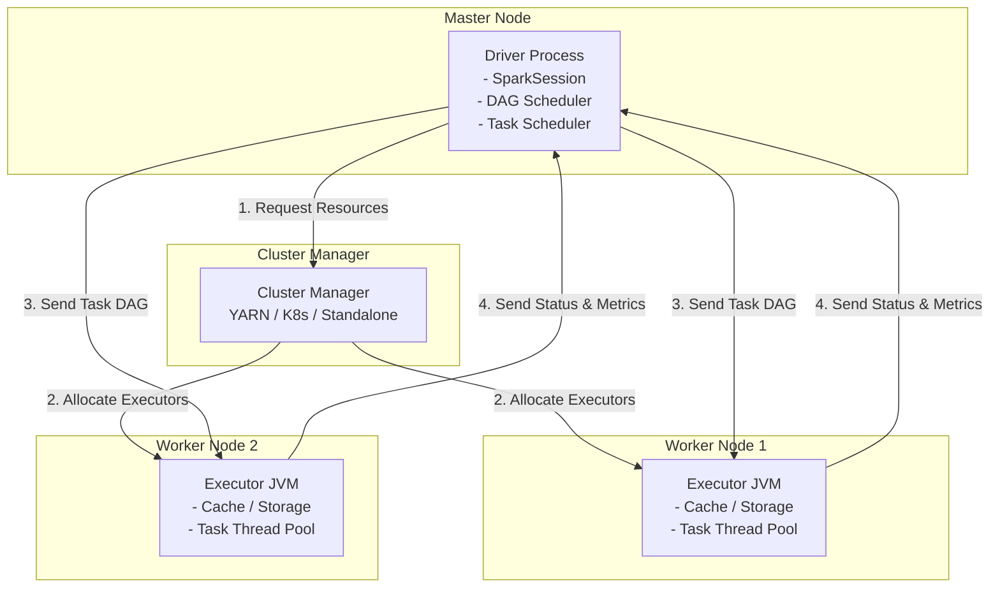

# ✨ Module 06: Apache Spark Core & SQL Mastery

Apache Spark is a unified, in-memory distributed analytics engine designed for large-scale data processing. Unlike legacy disk-bound frameworks (MapReduce), Spark executes operations in memory using a directed acyclic graph (DAG) execution engine, making it up to 100x faster for iterative algorithms and complex workflows.

---

## 1. Spark Cluster Architecture & Execution Model

Spark uses a Master-Slave architecture containing a coordinator process (Driver) and distributed worker nodes (Executors).



### Components Detailed:
* **Driver Program**: The orchestrator of the Spark application.
  * Creates the `SparkSession` (the entry point).
  * Converts developer code into a **Directed Acyclic Graph (DAG)** of operations.
  * Splits the DAG into logical execution **Stages**.
  * Schedules and distributes individual executable units (**Tasks**) to Executors.
* **Executor**: Worker JVM processes launched on cluster nodes.
  * Runs the tasks assigned by the driver using a thread pool.
  * Stores data cached by the user in-memory or on disk (BlockManager).
  * Reports task completion status and performance metrics back to the driver.

---

## 2. The DAG: Stages, Tasks, and Transformations

Spark builds a logical graph of executions called the Lineage Graph. Execution is deferred until an **Action** is invoked (Lazy Evaluation).

### Transformations vs. Actions:
* **Transformations**: Read or manipulate data, producing a new RDD/DataFrame. They are lazily evaluated.
  * *Narrow Transformations*: The child partition depends on a single parent partition (e.g., `map()`, `filter()`, `flatMap()`). These do not require network shuffles and execute within the same stage.
  * *Wide Transformations*: The child partition depends on multiple parent partitions (e.g., `groupByKey()`, `reduceByKey()`, `join()`, `repartition()`). These force a **Shuffle Boundary**, ending the current stage and spawning a new stage.
* **Actions**: Trigger the evaluation of all recorded transformations and return results to the driver or write data to HDFS/S3 (e.g., `collect()`, `count()`, `saveAsTextFile()`).

```mermaid
flowchart LR
    subgraph Stage 1 (Narrow)
        R1[Read File] --> T1[Filter]
        T1 --> T2[Map]
    end
    
    T2 -- Wide Shuffle (Repartition) --> Stage2
    
    subgraph Stage 2 (Wide)
        Stage2[ReduceByKey] --> Action[Save / Output]
    end
    
    style T2 fill:#fbb,stroke:#333
    style Stage2 fill:#fbb,stroke:#333
```

---

## 3. RDD vs. DataFrame vs. Dataset

| Feature | RDD (Resilient Distributed Dataset) | DataFrame | Dataset |
| :--- | :--- | :--- | :--- |
| **API Type** | Low-level object API. | Declarative relational API. | Strongly-typed object API. |
| **Data Representation** | JVM Java/Scala Objects. | Rows of Spark SQL Schema. | Typed JVM Case Classes. |
| **Type Safety** | Compile-time safe. | Runtime safe (No schema check at compile time). | Compile-time safe. |
| **Optimizer Integration** | None (Runs user code as-is). | Highly optimized via Catalyst & Tungsten. | Optimized (with JVM serialization overhead). |
| **Language Support** | Scala, Java, Python, R. | Scala, Java, Python, R. | Scala and Java only. |

---

## 4. Spark Optimization Engines: Catalyst & Tungsten

Modern Spark (DataFrame/Dataset APIs) achieves performance via two core engines.

### The Catalyst Optimizer:
An extensible query optimizer for Spark SQL and DataFrame operations. It goes through four phases:
1. **Analysis**: Resolves column and table names against the catalog metadata.
2. **Logical Optimization**: Applies rule-based optimizations such as **Constant Folding** (simplifying calculations) and **Predicate Pushdown** (pushing filters down to the file level to avoid reading redundant data).
3. **Physical Planning**: Generates multiple physical execution strategies and selects the cheapest option using a Cost Model.
4. **Code Generation**: Generates Java bytecode at runtime for execution on worker nodes.

### The Tungsten Engine:
Focuses on physical hardware optimization:
* **Off-Heap Memory Management**: Bypasses the JVM heap and GC overhead by allocating and managing memory directly inside raw byte arrays using an off-heap memory manager.
* **Cache-Aware Computation**: Designs algorithms (like sorting and hashing) that fit directly into L1/L2/L3 CPU cache lines to avoid waiting for RAM access.
* **Whole-Stage Code Generation**: Flattens nested expressions into a single, clean loop in bytecode, eliminating virtual function calls.

---

## 5. Distributed Join Strategies

Spark selects join strategies dynamically based on table size, join keys, and partition setups.

### 1. Broadcast Hash Join (BHJ)
* **Precondition**: One of the datasets must be small (default: `<10MB`, configured by `spark.sql.autoBroadcastJoinThreshold`).
* **Mechanism**: Spark copies (broadcasts) the small dataset to the memory of all executor nodes. Each executor loads it into a hash map and joins it locally with the partition of the large table.
* **Performance**: The fastest join strategy; requires zero network shuffles.

### 2. Shuffle Sort Merge Join (SMJ)
* **Precondition**: Large tables with matching join keys.
* **Mechanism**:
  1. **Shuffle**: Spark hashes the join key of both tables and shuffles matching key ranges to the same partitions.
  2. **Sort**: Within each executor partition, Spark sorts the data from both tables by the join key.
  3. **Merge**: Spark walks through both sorted lists sequentially and merges matching keys.
* **Performance**: Highly reliable and scalable; default for large-scale table joins.

### 3. Shuffle Hash Join (SHJ)
* **Precondition**: Used when partitions are already relatively small but not sorted, or if sort-merge join is disabled.
* **Mechanism**: Shuffles datasets by join keys, builds an in-memory hash map of one partition, and streams the second partition through it.

---

## 6. Spark Unified Memory Management

Spark executors split their JVM heap memory into Execution and Storage pools to balance processing and caching.

```text
Executor JVM Heap Memory Layout (spark.executor.memory)
┌──────────────────────────────────────────────────────────────────────────┐
│ Reserved Memory (300 MB)                                                 │
├──────────────────────────────────────────────────────────────────────────┤
│ Usable Memory (JVM Heap - 300 MB)                                        │
│  ├── User Memory (40%) - Spark Metadata, User Data structures, UDFs      │
│  └── Spark Memory (60% - spark.memory.fraction)                          │
│       ├── Storage Memory (50% - spark.memory.storageFraction)            │
│       │   - Caching (.cache(), .persist()), broadcast variables          │
│       └── Execution Memory (50%)                                         │
│           - Buffers for Shuffles, Joins, Aggregations                    │
└──────────────────────────────────────────────────────────────────────────┘
```

* **Unified Dynamic Borrowing**: Storage and Execution memory can borrow space from each other if the other is idle.
* **Preemption Rules**: If Execution memory requires space occupied by Storage, it will evict cached blocks to disk. However, Storage memory **cannot** evict Execution memory blocks. Execution tasks always take priority.

---

## 7. PySpark & DataFrame Code Implementations

### DataFrame Creation, Optimizations, & Join Example:
```python
from pyspark.sql import SparkSession
from pyspark.sql.functions import col, broadcast, expr

# Initialize optimized Spark Session
spark = SparkSession.builder \
    .appName("SparkOptimizedJoin") \
    .config("spark.sql.shuffle.partitions", "200") \
    .config("spark.sql.adaptive.enabled", "true") \
    .getOrCreate()

# 1. Read Large Sales Data (Parquet Columnar Format)
sales_df = spark.read.parquet("hdfs:///warehouse/sales")

# 2. Read Small Users Lookup Data (CSV format)
users_df = spark.read.option("header", "true").csv("hdfs:///warehouse/users.csv")

# 3. Filter and Add Column (Predicate Pushdown will optimize this filter)
filtered_sales = sales_df \
    .filter(col("amount") > 100.0) \
    .withColumn("taxed_amount", col("amount") * 1.18)

# 4. Perform Broadcast Hash Join (forcing broadcast on small users table)
joined_df = filtered_sales.join(
    broadcast(users_df),
    on="user_id",
    how="inner"
)

# 5. Cache intermediate results for repetitive action calls
joined_df.cache()

# 6. Execute Action (Outputs to console and saves to HDFS)
joined_df.show(10)
joined_df.write.partitionBy("country").parquet("hdfs:///warehouse/processed_sales")
```

---

## 🎯 Exam and Interview Traps

1. **Trap: What is the difference between `.cache()` and `.persist()`, and how do you choose?**
   * **Answer**: `.cache()` is a shorthand for `.persist(StorageLevel.MEMORY_ONLY)` (or `MEMORY_AND_DISK` for DataFrames). `.persist()` allows passing a specific `StorageLevel` parameter:
     * `MEMORY_ONLY`: Stores deserialized Java objects in memory. Fast but memory intensive.
     * `MEMORY_AND_DISK`: Spills partitions to local disk if memory is full.
     * `MEMORY_ONLY_SER`: Stores serialized byte arrays. Reduces RAM footprint at the cost of CPU serialization cycles.
     * `DISK_ONLY`: Stores blocks on local disk only.
     * `_2` suffix (e.g., `MEMORY_ONLY_2`): Replicates block data to two executor nodes for high fault tolerance.

2. **Trap: Why is it bad to run `.collect()` on large DataFrames, and what should you use instead?**
   * **Answer**: `.collect()` pulls all partition data from every distributed executor across the network to the single JVM of the Driver program. If the dataset size exceeds the Driver's heap memory (`spark.driver.memory`), the Driver crashes with an Out-of-Memory (OOM) error. Use `.take(n)` or `.show(n)` to fetch only a preview slice, or write the results directly to storage using `.write.save()`.

3. **Trap: What is Data Skewness in Spark, and how do you resolve it?**
   * **Answer**: Data Skewness occurs when one partition has significantly more records than the others (e.g., joining on a key where 90% of rows have the value `NULL` or a default ID like `0`). The task processing the skewed partition takes hours while all other tasks finish in seconds.
     * *Solutions*:
       1. **Salting**: Appending a random number prefix (e.g., `key_0`, `key_1`) to the join key of the skewed dataset, and replicating corresponding keys in the secondary dataset to distribute the load across multiple executors.
       2. **Adaptive Query Execution (AQE)**: Set `spark.sql.adaptive.skewJoin.enabled=true`. Spark automatically detects skewed partitions at runtime and splits them into smaller sub-partitions.
