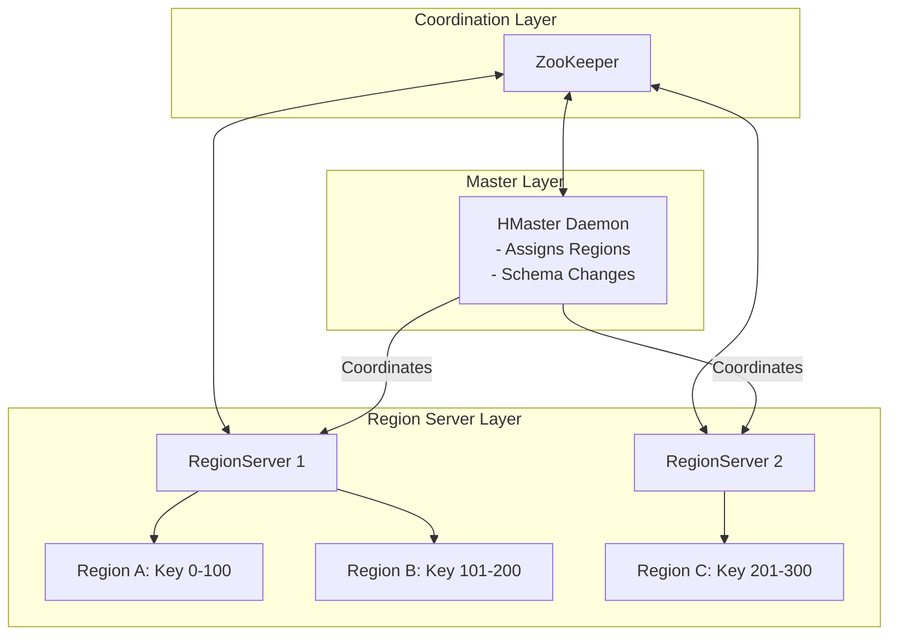

# 🌐 Module 08: NoSQL & Distributed Internals Mastery

Modern data engineering handles massive read/write volumes that traditional relational databases (RDBMS) cannot scale to support. To build real-time analytics platforms, you must master write-optimized storage engines (LSM Trees), distributed architectures (Master-slave HBase vs. Peer-to-peer Cassandra), and the physical laws governing distributed networks (CAP Theorem).

---

## 1. Storage Engines: LSM-Tree vs. B-Tree

Database design centers on a fundamental trade-off: optimizing for read latency or write throughput.

```mermaid
flowchart LR
    subgraph LSM-Tree Write Path (Write-Optimized)
        Client[Write Query] --> WAL[1. Write-Ahead Log \n Sequential Disk Write]
        Client --> MemTable[2. MemTable \n Sorted JVM RAM]
        MemTable -- Flush when full --> SSTable[3. SSTable / HFile \n Immutable Disk Files]
        SSTable -- 4. Background Compaction --> MergedSSTable[Merged & Deduplicated File]
    end
```

### B-Tree (Read-Optimized)
* **Mechanism**: Keeps data sorted in hierarchical page structures. Writes are performed **in-place** (updating existing records on specific disk sectors).
* **Disk I/O**: Requires random access writes, causing disk head movements.
* **Use Case**: Relational databases (MySQL, PostgreSQL) requiring fast random lookups.

### LSM-Tree (Log-Structured Merge-Tree - Write-Optimized)
* **Mechanism**: Bypasses in-place updates. All writes are **append-only**.
  1. **Write-Ahead Log (WAL)**: The write is appended sequentially to a log file on disk for crash recovery (zero disk-seek penalty).
  2. **MemTable**: The record is written to a sorted in-memory tree (e.g., SkipList).
  3. **Flush**: When the MemTable is full, it is flushed to disk as an immutable **SSTable** (Sorted String Table) file.
  4. **Compaction**: Background threads perform merge-sorts to consolidate SSTables and purge deleted records (marked with "Tombstones") and older values.
* **Disk I/O**: All disk writes are sequential.
* **Use Case**: High-write databases (HBase, Cassandra, RocksDB).

---

## 2. Apache HBase Architecture (Master-Slave NoSQL)

HBase is a sparse, distributed, persistent multi-dimensional sorted map built directly on top of HDFS.



* **Region**: A subset of a table's rows containing a sorted range of row keys.
* **HMaster**: Coordinates the cluster, monitors RegionServers, and manages schema updates.
* **RegionServer**: Hosts regions and serves client read/write requests.
* **The Read Path Optimization (Bloom Filters)**:
  * To avoid scanning every physical HFile on HDFS when reading a key, HBase uses **Bloom Filters** (space-efficient probabilistic data structures).
  * The Bloom Filter tells HBase with 100% certainty if a key is **not** in a specific HFile, letting HBase skip reading those files entirely.

---

## 3. Apache Cassandra Architecture (Masterless NoSQL)

Cassandra uses a decentralized, peer-to-peer ring topology based on the Amazon Dynamo paper.

```text
Cassandra Peer-to-Peer Ring Topology:

           [Node 1: Token 0-25]
         /                      \
[Node 4: Token 76-99]         [Node 2: Token 26-50]
         \                      /
           [Node 3: Token 51-75]
           
* Nodes communicate via Gossip Protocol (failures and topology metadata).
* Data partition: Partition Key Hashed (Murmur3Partitioner) -> mapped to corresponding Token host.
```

### Tunable Consistency Math:
Cassandra allows choosing consistency levels on a per-query basis. Let:
* $N$ = Replication Factor (number of nodes hosting a data copy).
* $W$ = Write Consistency Level (number of nodes that must ACK a write before success).
* $R$ = Read Consistency Level (number of nodes that must respond to a read query).

$$\text{Strong Consistency Requirement: } W + R > N$$

* **Example**: If $N=3$, $W=\text{QUORUM}$ (2 nodes), and $R=\text{QUORUM}$ (2 nodes):
  $$W+R = 2+2 = 4 > 3$$
  This guarantees that at least one node in the read response set contains the latest write, ensuring **Strong Consistency**. If $W+R \le N$, the system behaves with **Eventual Consistency**.

---

## 4. Complete NoSQL Shell Command Reference Library

This library lists the essential commands for executing queries and managing distributed NoSQL engines.

### A. Apache HBase Shell Commands
Start HBase shell: `hbase shell`
* **Table Administration**:
  ```hbase
  -- Create table 'sensor_data' with column family 'cf_metric'
  create 'sensor_data', 'cf_metric'
  
  -- Describe table properties and configuration parameters
  describe 'sensor_data'
  
  -- Disable and Drop table
  disable 'sensor_data'
  drop 'sensor_data'
  ```
* **Data Manipulation**:
  ```hbase
  -- Put row (RowKey: device_101, ColumnFamily: cf_metric, ColumnQualifier: temp, Value: 36.5)
  put 'sensor_data', 'device_101', 'cf_metric:temp', '36.5'
  
  -- Get specific row
  get 'sensor_data', 'device_101'
  
  -- Scan table (Limit results to 5 and set column filter)
  scan 'sensor_data', {COLUMNS => ['cf_metric:temp'], LIMIT => 5}
  ```
* **Cluster Management**:
  ```hbase
  status     -- Print cluster nodes load stats
  balancer   -- Trigger the load balancer to distribute regions evenly
  ```

### B. Apache Cassandra CQLSH & Nodetool
Start Cassandra SQL shell: `cqlsh`
* **Keyspace & Table DDL (CQL)**:
  ```sql
  -- Create keyspace with NetworkTopology replication strategy
  CREATE KEYSPACE iot_warehouse 
  WITH replication = {'class': 'NetworkTopologyStrategy', 'datacenter1': 3};
  
  USE iot_warehouse;
  
  -- Create table with Partition Key (device_id) and Clustering Key (event_time)
  CREATE TABLE readings (
      device_id text,
      event_time timestamp,
      value double,
      PRIMARY KEY (device_id, event_time)
  ) WITH CLUSTERING ORDER BY (event_time DESC);
  ```
* **CQL Data Operations**:
  ```sql
  -- Insert data
  INSERT INTO readings (device_id, event_time, value) VALUES ('dev_1', '2026-07-01 10:00:00', 12.5);
  
  -- Query data
  SELECT * FROM readings WHERE device_id = 'dev_1' AND event_time > '2026-07-01 00:00:00';
  ```
* **Node Administration & Diagnostics (`nodetool`)**:
  ```bash
  # Check node status (shows Up/Down, State, Loads, and Tokens owned)
  nodetool status
  
  # Inspect token distribution details of the ring
  nodetool ring
  
  # Trigger data sync across replica nodes (anti-entropy repair)
  nodetool repair iot_warehouse
  ```

---

## 5. The CAP Theorem & Distributed Consistency Models

Formulated by Eric Brewer, the CAP Theorem dictates that a distributed system can guarantee at most two of these three properties:

```text
               Consistency (CP)
              /                \
             /   Network        \
            /    Partition       \
           /     (Inevitable)     \
          /                        \
Availability (AP) ────────────────── Partition Tolerance
```

1. **Consistency (C)**: Every read receives the most recent write or an error.
2. **Availability (A)**: Every non-failing node returns a non-error response.
3. **Partition Tolerance (P)**: The system continues to operate despite network packet losses or node failures.

---

## 6. Enterprise Job Interview Q&A (NoSQL & Internals)

This section prepares you for production-level interview questions.

### Q1: Explain the detailed Read and Write paths of Apache HBase. How does it achieve sub-millisecond writes on HDFS, which is append-only?
* **How to explain this to the interviewer**:
  Differentiate between the write path (WAL -> MemStore -> HFiles on HDFS) and the read path (BlockCache -> MemStore -> HFiles with Bloom filters). Emphasize that writes are fast because they are sequential appends in RAM/WAL.

* **Model Answer**:
  "**HBase Write Path**:
  When a client submits a write request (Put):
  1. The client queries ZooKeeper to find the RegionServer hosting the row key.
  2. The client sends the write to the RegionServer.
  3. The RegionServer appends the write sequentially to the **Write-Ahead Log (WAL)** on HDFS for durability.
  4. Once written to the WAL, the record is placed in the **MemStore** (an in-memory sorted write buffer).
  5. The server immediately returns success to the client (sub-millisecond latency).
  6. When the MemStore reaches its limit (e.g. 128MB), it is flushed to HDFS as an immutable **HFile**.
  
  **HBase Read Path**:
  Reads are more complex because data for a key might reside in the MemStore, cached blocks, or across multiple flushed HFiles.
  1. The RegionServer checks the **BlockCache** (in-memory read cache).
  2. It checks the **MemStore** (for un-flushed writes).
  3. If not found, it scans HFiles on HDFS. To prevent reading all HFiles, HBase queries **Bloom Filters** located in the file metadata. If the Bloom filter returns false, HBase skips reading that HFile entirely.
  4. It merges the inputs and returns the latest cell version."

---

### Q2: How does Cassandra distribute data across a masterless ring? Explain Partition Keys, Clustering Keys, and Consistent Hashing.
* **How to explain this to the interviewer**:
  Explain token rings and Murmur3 partitioning. Define the separate roles of the Partition Key (nodes mapping) and Clustering Key (on-disk sorting).

* **Model Answer**:
  "Cassandra distributes data using **Consistent Hashing** over a logical token ring.
  
  Every node in the ring is assigned one or more tokens (ranges of numbers between $-2^{63}$ and $2^{63}-1$).
  
  1. **Consistent Hashing & Token Mapping**:
     When a write query arrives, Cassandra hashes the **Partition Key** of the row using the `Murmur3Partitioner` to generate a token. The coordinator node routes the write to the node hosting that specific token range, along with $N-1$ replica nodes.
     
  2. **Partition Key vs. Clustering Key**:
     In Cassandra's primary key design:
     * **Partition Key**: The first column listed in the primary key. It determines which node hosts the row.
     * **Clustering Key**: The remaining columns in the primary key. It determines the **physical sort order** of the data rows within the partition directory on local disk (SSTable). This enables fast, sequential range scans for a given partition key (e.g., selecting all log readings for a single device ID sorted by timestamp)."

---

### Q3: What is the CAP Theorem? Give a concrete example of a database cluster partitioning event, and compare how a CP database and an AP database handle it.
* **How to explain this to the interviewer**:
  Do not just define the letters. Give a scenario (network switch split). Then compare the behavior of a CP database (blocking writes to prevent split-brain) vs. an AP database (accepting writes on both sides and resolving later).

* **Model Answer**:
  "The CAP Theorem states that in a distributed data store, when a network partition (**P**) occurs, you must choose between Consistency (**C**) or Availability (**A**).
  
  **Partition Scenario**:
  Suppose a 5-node cluster is split by a network switch failure into two isolated partitions: Partition L (3 nodes, including the master) and Partition R (2 nodes).
  
  * **HBase (CP - Consistency Focus)**:
    If a client writes a row key to Partition R, the RegionServers in Partition R cannot communicate with the HMaster or ZooKeeper quorum in Partition L. To prevent **split-brain data corruption** (both partitions accepting conflicting updates), HBase will:
    1. Mark the isolated regions as offline.
    2. Deny client writes and reads, returning errors.
    The database sacrifices Availability to ensure Consistency (no stale reads).
    
  * **Cassandra (AP - Availability Focus)**:
    If a client writes data to Partition R, Cassandra nodes accept the write locally. If the write quorum cannot be met, they store a **Hinted Handoff** (a local log tracking the write). The database continues to return success to the client.
    When the network partition heals, Partition R replays the hints to Partition L to sync states, resolving conflicts using timestamps (Last-Write-Wins). The database sacrifices absolute Consistency (stale reads occur mid-partition) to guarantee 100% Availability."
