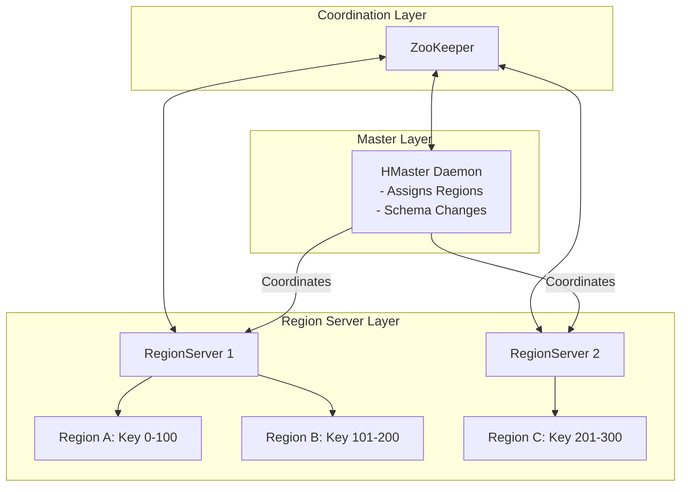

# 🌐 Module 08: NoSQL & Distributed Internals Mastery

Modern data engineering handles massive read/write volumes that traditional relational databases (RDBMS) cannot scale to support. To build real-time analytics platforms, you must master write-optimized storage engines (LSM Trees), distributed architectures (Master-slave HBase vs. Peer-to-peer Cassandra), and the physical laws governing distributed networks (CAP Theorem).

---

## 1. Storage Engines: LSM-Tree vs. B-Tree

Database design centers on a fundamental trade-off: optimizing for read latency or write throughput.

```mermaid
flowchart LR
    subgraph LSM-Tree Write Path (Write-Optimized)
        Client[Write Query] --> WAL[1. Write-Ahead Log \n Sequential Disk Write]
        Client --> MemTable[2. MemTable \n Sorted JVM RAM]
        MemTable -- Flush when full --> SSTable[3. SSTable / HFile \n Immutable Disk Files]
        SSTable -- 4. Background Compaction --> MergedSSTable[Merged & Deduplicated File]
    end
```

### B-Tree (Read-Optimized)
* **Mechanism**: Keeps data sorted in hierarchical page structures. Writes are performed **in-place** (updating existing records on specific disk sectors).
* **Disk I/O**: Requires random access writes, causing disk head movements.
* **Use Case**: Relational databases (MySQL, PostgreSQL) requiring fast random lookups.

### LSM-Tree (Log-Structured Merge-Tree - Write-Optimized)
* **Mechanism**: Bypasses in-place updates. All writes are **append-only**.
  1. **Write-Ahead Log (WAL)**: The write is appended sequentially to a log file on disk for crash recovery (zero disk-seek penalty).
  2. **MemTable**: The record is written to a sorted in-memory tree (e.g., SkipList).
  3. **Flush**: When the MemTable is full, it is flushed to disk as an immutable **SSTable** (Sorted String Table) file.
  4. **Compaction**: Background threads perform merge-sorts to consolidate SSTables and purge deleted records (marked with "Tombstones") and older values.
* **Disk I/O**: All disk writes are sequential.
* **Use Case**: High-write databases (HBase, Cassandra, RocksDB).

---

## 2. Apache HBase Architecture (Master-Slave NoSQL)

HBase is a sparse, distributed, persistent multi-dimensional sorted map built directly on top of HDFS.



* **Region**: A subset of a table's rows containing a sorted range of row keys.
* **HMaster**: Coordinates the cluster, monitors RegionServers, and manages schema updates. It does not handle client read/write paths.
* **RegionServer**: Hosts regions and serves client read/write requests.
* **The Read Path Optimization (Bloom Filters)**:
  * To avoid scanning every physical HFile on HDFS when reading a key, HBase uses **Bloom Filters** (space-efficient probabilistic data structures).
  * The Bloom Filter tells HBase with 100% certainty if a key is **not** in a specific HFile, letting HBase skip reading those files entirely.

---

## 3. Apache Cassandra Architecture (Masterless NoSQL)

Cassandra uses a decentralized, peer-to-peer ring topology based on the Amazon Dynamo paper.

```text
Cassandra Peer-to-Peer Ring Topology:

           [Node 1: Token 0-25]
         /                      \
[Node 4: Token 76-99]         [Node 2: Token 26-50]
         \                      /
           [Node 3: Token 51-75]
           
* Nodes communicate via Gossip Protocol (failures and topology metadata).
* Data partition: Partition Key Hashed (Murmur3Partitioner) -> mapped to corresponding Token host.
```

### Tunable Consistency Math:
Cassandra allows choosing consistency levels on a per-query basis. Let:
* $N$ = Replication Factor (number of nodes hosting a data copy).
* $W$ = Write Consistency Level (number of nodes that must ACK a write before success).
* $R$ = Read Consistency Level (number of nodes that must respond to a read query).

$$\text{Strong Consistency Requirement: } W + R > N$$

* **Example**: If $N=3$, $W=\text{QUORUM}$ (2 nodes), and $R=\text{QUORUM}$ (2 nodes):
  $$W+R = 2+2 = 4 > 3$$
  This guarantees that at least one node in the read response set contains the latest write, ensuring **Strong Consistency**. If $W+R \le N$, the system behaves with **Eventual Consistency**.

---

## 4. The CAP Theorem & Distributed Consistency Models

Formulated by Eric Brewer, the CAP Theorem dictates that a distributed system can guarantee at most two of these three properties:

```text
               Consistency (CP)
              /                \
             /   Network        \
            /    Partition       \
           /     (Inevitable)     \
          /                        \
Availability (AP) ────────────────── Partition Tolerance
```

1. **Consistency (C)**: Every read receives the most recent write or an error.
2. **Availability (A)**: Every non-failing node returns a non-error response (without guarantee that it contains the latest write).
3. **Partition Tolerance (P)**: The system continues to operate despite network packet losses or node failures.

### The Trade-off:
Because physical hardware networks will inevitably drop packets, you must assume Partition Tolerance (**P**). Thus, when a partition occurs, you must choose:
* **CP (Consistency/Partition Tolerance)**: Deny writes and reads if nodes cannot sync. The system goes offline to preserve data accuracy (e.g., HDFS, HBase, ZooKeeper).
* **AP (Availability/Partition Tolerance)**: Allow writes and reads on isolated partitions. Nodes accept data and resolve conflicts later, preferring uptime over absolute accuracy (e.g., Cassandra, DynamoDB).

### ACID vs. BASE:
* **ACID (Relational - CP Focus)**: Atomicity, Consistency, Isolation, Durability.
* **BASE (NoSQL - AP Focus)**: Basically Available, Soft State, Eventual Consistency.

---

## 5. Distributed Consensus: Paxos vs. Raft

Distributed databases must agree on configuration states (e.g., who is the active master NameNode, or what is the partition offset). This requires consensus protocols.

* **Paxos**: The classic consensus protocol. It is mathematically complete but complex to implement, leading to custom variations.
* **Raft**: Designed as an understandable alternative to Paxos. It decomposes consensus into explicit sub-problems:
  1. **Leader Election**: A node acts as leader and manages replication. If the leader goes offline, a new election is triggered.
  2. **Log Replication**: The leader receives log entries, replicates them to followers, and commits them only when a majority of followers acknowledge the write.
  3. **Safety**: Raft guarantees that if a node applies a log entry at a specific index, no other node will ever apply a different log entry for that index.
  * *Applications*: KRaft (Kafka Raft), ZooKeeper (uses ZAB, a Paxos variant), Etcd (Kubernetes backing store).

---

## 🎯 Exam and Interview Traps

1. **Trap: Why should you avoid using timestamps as HBase row keys?**
   * **Answer**: HBase partitions tables by sorted row keys. If you use a monotonically increasing timestamp as the row key prefix (e.g., `1688192800000_userid`), all write requests will hit the exact same RegionServer (the one hosting the end of the key range). The rest of the cluster sits idle. This is called **Hotspotting**. Solve this by prepending a hash prefix or reversing the timestamp/ID to distribute writes evenly.

2. **Trap: In Cassandra, does setting $W=\text{ONE}$ and $R=\text{ALL}$ guarantee strong consistency?**
   * **Answer**: Yes.
     $$W+R = 1 + N > N \implies 1 + N > N$$
     This satisfies the strong consistency equation. However, if a single node in the cluster is offline, read queries will fail because $R=\text{ALL}$ requires acknowledgments from all $N$ replicas, which hurts availability.

3. **Trap: Why does HDFS fall under the CP category of CAP, while Cassandra falls under AP?**
   * **Answer**: If a network partition occurs and splits the HDFS cluster, the ZooKeeper Failover Controller and NameNode will block writes to the isolated nodes to prevent split-brain directory corruption, prioritizing Consistency over Availability. Cassandra nodes, being masterless, will continue to accept writes locally and resolve differences later using hints, prioritizing Availability over Consistency.
