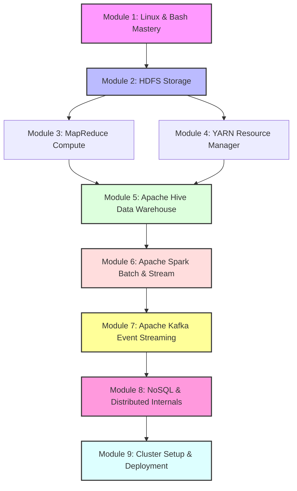

# 🐘 Big Data Developer & Architect Mastery Guide

Welcome to the ultimate, production-grade Big Data Learning Repository. This repository is rebuilt to serve as a comprehensive, step-by-step masterclass for software engineers, data engineers, and architects looking to master distributed systems, large-scale storage, stream processing, and data warehousing.

Each module in this guide is designed to go **100x deeper** than basic command sheets, combining core theoretical architecture, system configuration math, interactive CLI command lists, troubleshooting tips, and interview traps.

---

## 🗺️ Big Data Mastery Roadmap

Here is the step-by-step learning progression designed to take you from a system administrator to a Big Data Solution Architect.

---

## 📂 Curriculum Structure & Navigation

Follow this step-by-step path to master the ecosystem.

| Stage | Module | Key Focus Areas | Link to Guide |
|:---|:---|:---|:---|
| **0** | **Roadmap & Study Guide** | Study workflow, certifications, and project roadmap | [Study Roadmap](file:///C:/Users/kadam/.gemini/antigravity/scratch/BIGDATA-command/00_Roadmap_and_Guide/roadmap.md) |
| **1** | **Linux & Bash Mastery** | Shell programming, processes, networking, resource limit tuning | [Linux & Bash Guide](file:///C:/Users/kadam/.gemini/antigravity/scratch/BIGDATA-command/01_Linux_and_Bash/linux_bash_mastery.md) |
| **2** | **HDFS Storage Mastery** | Storage internals, block allocation, high availability (HA), federation | [HDFS Storage Guide](file:///C:/Users/kadam/.gemini/antigravity/scratch/BIGDATA-command/02_HDFS_Storage/hdfs_mastery.md) |
| **3** | **MapReduce Compute** | Execution lifecycle, joins (map-side vs reduce-side), cache | [MapReduce Guide](file:///C:/Users/kadam/.gemini/antigravity/scratch/BIGDATA-command/03_MapReduce/mapreduce_mastery.md) |
| **4** | **YARN Resource Management** | Capacity & Fair schedulers, resource calculation, container limits | [YARN Guide](file:///C:/Users/kadam/.gemini/antigravity/scratch/BIGDATA-command/04_YARN_Resource_Manager/yarn_mastery.md) |
| **5** | **Apache Hive Data Warehouse** | Partitions, Buckets, ACID tables, ORC/Parquet optimization, CBO | [Apache Hive Guide](file:///C:/Users/kadam/.gemini/antigravity/scratch/BIGDATA-command/05_Apache_Hive/hive_mastery.md) |
| **6** | **Apache Spark (Core & SQL)** | Catalyst, Tungsten, RDD/DataFrames, memory allocation, Join strategies | [Spark Core & SQL](file:///C:/Users/kadam/.gemini/antigravity/scratch/BIGDATA-command/06_Apache_Spark/spark_core_and_sql.md) |
| **6** | **Apache Spark (Streaming)** | Structured Streaming, Watermarks, sliding windows, stateful operations | [Spark Streaming](file:///C:/Users/kadam/.gemini/antigravity/scratch/BIGDATA-command/06_Apache_Spark/spark_streaming.md) |
| **7** | **Apache Kafka Streaming** | Broker internals, partition sizing, replicas, idempotent producers | [Apache Kafka Guide](file:///C:/Users/kadam/.gemini/antigravity/scratch/BIGDATA-command/07_Apache_Kafka/kafka_mastery.md) |
| **8** | **NoSQL & Internals** | LSM-trees, HBase, Cassandra, Paxos/Raft consensus, CAP Theorem | [NoSQL & Internals](file:///C:/Users/kadam/.gemini/antigravity/scratch/BIGDATA-command/08_NoSQL_and_Distributed_Internals/nosql_and_internals.md) |
| **9** | **Cluster Setup & Deployment** | `core-site.xml`, `hdfs-site.xml`, XML properties, Docker deployments | [Cluster Deployment](file:///C:/Users/kadam/.gemini/antigravity/scratch/BIGDATA-command/09_Cluster_Setup_and_Deployment/cluster_deployment.md) |

---

## 🗄️ Original Notes (Archived)
If you wish to view your original cheat sheets and commands, they are safely preserved inside the [/archive/](file:///C:/Users/kadam/.gemini/antigravity/scratch/BIGDATA-command/archive) directory.
